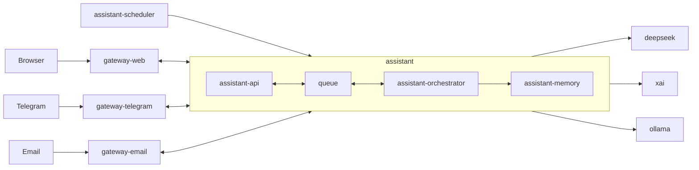

# MyConcierge

MyConcierge is a personal home assistant for one user.
It is a small and minimal alternative to heavier systems like OpenClaw.

## Why This Project Exists

- This project is part of my learning process to understand how to build agents.
- I also ran into resource problems with OpenClaw on my Raspberry Pi, so I want a smaller system that fits my hardware better.

## What Works Now

- Web chat with LLM responses through `gateway-web`, `assistant-api`, and `assistant-orchestrator`
- Conversation context in the current chat flow

## Roadmap

- Email integration
- Telegram integration
- Scheduler
- Agent looping
- Skills
- Tools

## Principles

- Minimal resource usage
- Clear architecture and relationships
- Minimal runtime components
- Run well on home infrastructure
- Stay easy to extend later

## Planned Runtime

- Docker Compose as default runtime
- Docker for single-container cases
- Kubernetes
- Kubernetes CronJob for scheduled tasks

## Tech Direction

- Node.js
- TypeScript with strict mode
- NestJS
- Environment-based configuration
- Multiple LLM providers: DeepSeek, xAI, OpenAI, and Ollama
- Extensible LLM provider layer for future providers
- Prometheus metrics

## Repository Status

This repository now contains implemented services: `assistant-api`, `assistant-orchestrator`, `assistant-llm`, `assistant-memory`, `gateway-web`, `gateway-email`, `gateway-telegram`, and `dashboard`.
Additional components such as `assistant-scheduler` are currently documented as target services.
The current source of truth is the code for these services and the project documentation for the wider system.

## Documents

- [Project instructions](./AGENTS.md)
- [Overview](./docs/overview.md)
- [Requirements](./docs/requirements.md)
- [Runtime architecture](./docs/architecture/runtime.md)
- [System components](./docs/architecture/components.md)
- [Data flow](./docs/architecture/data-flow.md)
- [Conversation](./docs/architecture/conversation.md)
- [Queue communication](./docs/architecture/queue-flow.md)
- [Callback architecture](./docs/architecture/callback-flow.md)
- [Memory architecture](./docs/architecture/memory.md)
- [Persistence schema](./docs/architecture/persistence-schema.md)
- [Repository layout](./docs/architecture/repository-layout.md)
- [Application endpoints](./docs/contracts/application-endpoints.md)
- [assistant-orchestrator system prompt](./docs/contracts/assistant-orchestrator-system-prompt.md)
- [Docker Compose](./docs/deployment/docker-compose.md)
- [Assistant](./docs/services/assistant.md)
- [Assistant Memory](./docs/services/assistant/assistant-memory.md)
- [Prometheus](./docs/services/prometheus.md)
- [Metrics](./docs/operations/metrics.md)

## Implemented Today

- Local runtime named `assistant`
- Core backend split into `assistant-api` and `assistant-orchestrator`
- Redis-based asynchronous flow between `assistant-api` and `assistant-orchestrator` in both directions
- `assistant-api` accepts requests, validates them, enqueues jobs, consumes run events, and owns all external callbacks
- `assistant-api` supports env-based queue adapters and currently uses Redis by default through `QUEUE_ADAPTER=redis`
- `assistant-orchestrator` reads queued jobs, loads bootstrap runtime context from `runtime/assistant-orchestrator/`, runs the execution flow via `assistant-llm`, publishes run events, and appends canonical conversation state through `assistant-memory`
- `assistant-memory` exposes typed memory APIs for profile state, search, writes, archive, compact, and reindex operations
- `gateway-web` provides the browser chat UI, persists browser chat history in `runtime/gateway-web/`, and uses a cookie-backed session id
- `gateway-web` exposes `/`, `WS /ws`, `/response/:conversationId`, `/thinking/:conversationId`, `/status`, `/metrics`, and `/openapi.json`
- `gateway-telegram` provides its own web panel, keeps a local chat runtime, and delivers replies through the Telegram Bot API with preserved reply context
- `gateway-email` provides its own web panel, keeps a local mailbox runtime, syncs IMAP state, and delivers replies by SMTP with preserved thread headers
- `dashboard` aggregates service links and polls service statuses over HTTP every `DASHBOARD_REFRESH_SECONDS`
- `assistant-api`, `assistant-orchestrator`, `assistant-llm`, `assistant-memory`, `gateway-web`, `gateway-telegram`, `gateway-email`, and `dashboard` expose `/status`, `/metrics`, and OpenAPI documentation
- Default local runtime is Docker Compose
- The system is prepared for home deployment and future horizontal scaling

## Target Architecture

- `assistant-scheduler` triggers scheduled work through `assistant-api`
- one shared Swagger UI exposes the available OpenAPI schemas across runtime services

## Gateway Rollout Order

1. `gateway-web`
2. `gateway-email`
3. `gateway-telegram`

## Services

### Structure

- [assistant](./docs/services/assistant.md): core backend component that includes [assistant-api](./docs/services/assistant/assistant-api.md), [queue](./docs/services/queue.md), [assistant-orchestrator](./docs/services/assistant/assistant-orchestrator.md), [assistant-llm](./docs/services/assistant/assistant-llm.md), and [assistant-memory](./docs/services/assistant/assistant-memory.md)
- [assistant-memory](./docs/services/assistant/assistant-memory.md): durable memory service for profile state and memory operations
- [gateways](./docs/services/gateways.md): channel-facing layer that includes [gateway-web](./docs/services/gateways/gateway-web.md), [gateway-telegram](./docs/services/gateways/gateway-telegram.md), and [gateway-email](./docs/services/gateways/gateway-email.md)
- [assistant-scheduler](./docs/services/assistant-scheduler.md): scheduled trigger component that only sends requests into `assistant`



### Runtime Directory

The local runtime is named `assistant`.
It is split into service-specific runtime directories under `runtime/`.
In Docker Compose, each service mounts only its own runtime directory:
- `assistant-orchestrator`: `./runtime/assistant-orchestrator:/app/runtime`
- `gateway-web`: `./runtime/gateway-web:/app/runtime`
- `gateway-telegram`: `./runtime/gateway-telegram:/app/runtime`
- `gateway-email`: `./runtime/gateway-email:/app/runtime`

Expected runtime files and folders:

- `runtime/assistant-orchestrator/SYSTEM.js`
- `runtime/assistant-orchestrator/skills/`
- `runtime/assistant-orchestrator/config/`
- `runtime/assistant-orchestrator/data/`
- `runtime/gateway-web/conversations/`
- `runtime/gateway-telegram/conversations/`
- `runtime/gateway-email/conversations/`

The runtime directory is not baked into the Docker image.
The repository already includes a starter runtime directory in [runtime](./runtime) with placeholder instruction files.
Filesystem tools in `assistant-orchestrator` are sandboxed to `ASSISTANT_ORCHESTRATOR_HOME`, which defaults to `runtime/assistant-orchestrator/data` in Docker Compose.

### assistant-api

- [assistant-api](./docs/services/assistant/assistant-api.md): receives inbound requests, validates them, enqueues work, consumes run events, and owns external callback delivery

### assistant-orchestrator

- [assistant-orchestrator](./docs/services/assistant/assistant-orchestrator.md): processes queued jobs, runs runtime/tool orchestration, publishes run events, and exposes operational endpoints
- [assistant-llm](./docs/services/assistant/assistant-llm.md): central LLM provider, model, and generation service for orchestrator and memory enrichment

### assistant-memory

- [assistant-memory](./docs/services/assistant/assistant-memory.md): durable memory service for retrieval, writes, profile state, and maintenance

### assistant

- [assistant](./docs/services/assistant.md): groups `assistant-api`, `queue`, `assistant-orchestrator`, `assistant-llm`, and `assistant-memory` into the core backend component

### queue

- [queue](./docs/services/queue.md): transports execution jobs to `assistant-orchestrator` and run events back to `assistant-api`

### gateway-web

- [gateway-web](./docs/services/gateways/gateway-web.md): serves the browser chat UI and bridges browser traffic to `assistant`

### gateway-telegram

- [gateway-telegram](./docs/services/gateways/gateway-telegram.md): Telegram adapter for inbound messages and assistant replies

### gateway-email

- [gateway-email](./docs/services/gateways/gateway-email.md): Email adapter for inbound messages and assistant replies

### assistant-scheduler

- [assistant-scheduler](./docs/services/assistant-scheduler.md): scheduled trigger component that only sends requests into `assistant`

### swagger

- [swagger](./docs/services/swagger.md): shared OpenAPI viewer for runtime services

### dashboard

- dashboard: aggregated service dashboard with links, `UP/DOWN` tiles, and uptime-aware status polling

### prometheus

- [prometheus](./docs/services/prometheus.md): metrics scraper and query service for runtime components

## Metrics

Detailed metrics documentation lives in [docs/operations/metrics.md](./docs/operations/metrics.md).
It contains the metrics flow diagram and per-service metric tables.

## Local Ports

| Host port | Service | Purpose |
|---------|-------------|---------|
| [http://localhost:3000/](http://localhost:3000/) | [`assistant-api`](./docker-compose.yaml) | HTTP API |
| [http://localhost:3001/](http://localhost:3001/) | [`assistant-orchestrator`](./docker-compose.yaml) | Runtime orchestration service |
| [http://localhost:3003/](http://localhost:3003/) | [`assistant-llm`](./docker-compose.yaml) | LLM provider/model settings and generation API |
| [http://localhost:3002/](http://localhost:3002/) | [`assistant-memory`](./docker-compose.yaml) | Memory API and operational endpoints |
| [http://localhost:8079/](http://localhost:8079/) | [`gateway-web`](./docker-compose.yaml) | Web chat UI, WebSocket, callbacks |
| [http://localhost:8081/](http://localhost:8081/) | [`gateway-telegram`](./docker-compose.yaml) | Telegram gateway |
| [http://localhost:8082/](http://localhost:8082/) | [`gateway-email`](./docker-compose.yaml) | Email gateway |
| [http://localhost:8080/](http://localhost:8080/) | [`dashboard`](./docker-compose.yaml) | Service dashboard |

Notes:

- `queue` is internal-only in the current local `docker-compose` and is not exposed on a host port.
- `assistant-scheduler` is a target service and is not part of the current local `docker-compose`.
- All app containers use internal port `3000`.

## Run

1. Install Docker and Docker Compose.
2. Create the local env file:

```bash
make env
```

3. Configure one provider in `.env`.

For `deepseek`:
- `DEEPSEEK_API_KEY`

For `xai`:
- `XAI_API_KEY`

For local Ollama:
- `OLLAMA_BASE_URL=http://host.docker.internal:11434`
- `OLLAMA_MODEL=qwen3:1.7b`
- `LLM_RESPONSE_REPAIR_ATTEMPTS=1`

4. To switch provider or model, open [http://localhost:3003/](http://localhost:3003/) (or the dashboard) and update `assistant-llm` settings.

5. Start the local stack:

```bash
make up
```

6. Open the main entrypoints:

- [http://localhost:8080/](http://localhost:8080/) for `dashboard`
- [http://localhost:8079/](http://localhost:8079/) for `gateway-web`

7. Stop the stack:

```bash
make down
```

## Documentation Structure

- `docs/requirements.md`: high-level requirements
- `docs/architecture/`: runtime and component design
- `docs/services/`: service-by-service docs
- `docs/contracts/`: API and queue contracts
- `docs/deployment/`: runtime and deployment docs
- `docs/operations/`: observability and scaling docs

## Local Commands

- `make env`: create `.env` from `.env.example` if it does not exist
- `make build`: build local Docker images for the stack
- `make up`: start local Docker Compose stack and remove orphan containers from older service layouts
- `make down`: stop the local Docker Compose stack
- `npm run build`: build the NestJS service
- `npm test`: run unit tests
- `npm run test:e2e`: run e2e tests


## Out of Scope for First Version

- Multi-user support
- Authentication and authorization
- Complex UI
- Large infrastructure setup

## Next Step

Build the first MVP around one real user workflow and keep the system small.
