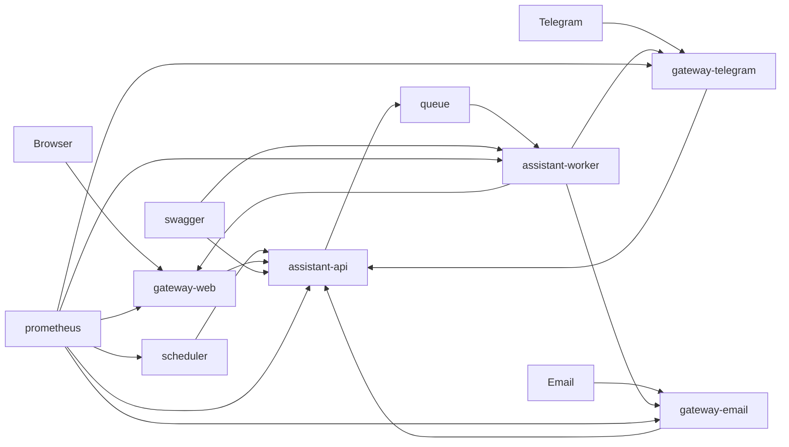

# MyConcierge

MyConcierge is a personal home assistant for one user.
It is a small and minimal alternative to heavier systems like OpenClaw.

## Goals

- Keep the system simple
- Use as few resources as possible
- Run well on home infrastructure
- Stay easy to extend later

## Main Principles

- Single-user system
- Minimal dependencies
- Minimal runtime services
- Clear and small architecture
- Container-first deployment

## Planned Runtime

- Docker Compose as default runtime
- Docker for single-container cases
- Kubernetes
- Kubernetes CronJob for scheduled tasks

## Tech Direction

- Node.js
- TypeScript with strict mode
- NestJS
- Environment-based configuration
- Multiple LLM providers: DeepSeek, xAI, OpenAI, and Ollama
- Extensible LLM provider layer for future providers
- Prometheus metrics

## Repository Status

This repository now contains implemented services: `gateway-web`, `assistant-api`, and `assistant-worker`.
The rest of the system is still described by documentation.
The current source of truth is the code for these services and the project documentation for the wider system.

## Documents

- [Project instructions](./AGENTS.md)
- [Overview](./docs/overview.md)
- [Requirements](./docs/requirements.md)
- [Runtime architecture](./docs/architecture/runtime.md)
- [System components](./docs/architecture/components.md)
- [Data flow](./docs/architecture/data-flow.md)
- [Repository layout](./docs/architecture/repository-layout.md)
- [Application endpoints](./docs/contracts/application-endpoints.md)
- [Docker Compose](./docs/deployment/docker-compose.md)

## Current Scope

- Local runtime named `assistant`
- Split runtime parts: `assistant-api` and `assistant-worker`
- Queue between `assistant-api` and `assistant-worker`
- Local agent runtime that reads `AGENTS.md`, `SOUL.md`, and `IDENTITY.md`
- Personal assistant backend
- Minimal REST API
- Interaction with `assistant` through `assistant-api`
- `assistant-api` only validates, enqueues, and acknowledges requests
- `assistant-api` is implemented in this repository root
- `assistant-api` supports env-based queue adapters
- `assistant-api` now uses Redis queue by default through `QUEUE_ADAPTER=redis`
- `assistant-worker` is implemented in this repository root
- `assistant-worker` reads Redis queue messages and sends simple callback replies
- Asynchronous conversation flow: accept -> queue -> callback
- `assistant-api` and `assistant-worker` each expose their own OpenAPI schema
- One shared Swagger UI for both OpenAPI schemas
- All runtime components expose `/status` and `/metrics`
- Startup from a working directory with runtime files
- Same internal port for app services in containers
- Default local and home runtime through Docker Compose
- Horizontal scaling for `assistant-api`, `assistant-worker`, Email, and worker processes
- Telegram channel through `assistant-api`
- Email channel through `assistant-api`
- Extensible channel model for future channels
- Simple Web chat through `gateway-web`
- Browser communication with `gateway-web` through WebSocket
- `gateway-web` is implemented in this repository root
- `gateway-web` exposes `/`, `WS /ws`, `/callbacks/assistant/:contact`, `/status`, `/metrics`, and `/openapi.json`
- Scheduled tasks through a Cron component and Kubernetes CronJob
- Heartbeat component through `assistant-api`
- Multi-LLM support through one shared integration layer
- Future LLM providers can be added through the same integration layer
- Prometheus metrics from `assistant-api`
- Queue depth metric in `/metrics`
- Ready for home and cluster deployment

## Service Structure

- `gateway-web`: simple Web chat, WebSocket entry point, callback receiver for browser replies
- `gateway-telegram`: Telegram adapter, sends inbound messages to `assistant-api`, receives Telegram callbacks
- `gateway-email`: Email adapter, sends inbound messages to `assistant-api`, receives Email callbacks
- `assistant-api`: public intake service, validates requests, writes jobs to Redis queue, returns acceptance responses, selects queue adapter through env
- `queue`: internal transport between `assistant-api` and `assistant-worker`
- `assistant-worker`: background worker, reads Redis queue messages, sends simple callback replies, and exposes worker status and metrics
- `scheduler`: cron-based trigger service, sends scheduled requests to `assistant-api`
- `swagger`: one shared Swagger UI for `assistant-api` and `assistant-worker`
- `prometheus`: collects metrics from runtime components

## Swagger

- `swagger` is a separate service
- it shows one shared Swagger UI
- it reads one OpenAPI schema from `http://localhost:3000/openapi.json`
- it reads one OpenAPI schema from `http://localhost:3001/openapi.json`
- it reads one OpenAPI schema from `http://localhost:8080/openapi.json`
- the UI lets you switch between the schemas
- in Docker Compose, Swagger UI is exposed on `http://localhost:8088`

## Local Ports

| Host port | Service | Purpose |
|---------|-------------|---------|
| `3000` | `assistant-api` | HTTP API, `/status`, `/metrics`, `/openapi.json` |
| `3001` | `assistant-worker` | Worker `/status`, `/metrics`, `/openapi.json` |
| `6379` | `queue` | Redis queue |
| `8080` | `gateway-web` | Web chat UI, WebSocket, callbacks, `/openapi.json` |
| `8081` | `gateway-telegram` | Telegram gateway |
| `8082` | `gateway-email` | Email gateway |
| `8088` | `swagger` | Shared Swagger UI |

Notes:

- `scheduler` does not publish a host port in the current local `docker-compose`.
- All app containers use internal port `3000`.

## Documentation Structure

- `docs/requirements.md`: high-level requirements
- `docs/architecture/`: runtime and component design
- `docs/services/`: service-by-service docs
- `docs/contracts/`: API and queue contracts
- `docs/deployment/`: runtime and deployment docs
- `docs/operations/`: observability and scaling docs

## Local Commands

- `make build`: build local `assistant-api`, `assistant-worker`, and `gateway-web` Docker images
- `make up`: start local `assistant-api`, `assistant-worker`, and `gateway-web`
- `make down`: stop the local Docker Compose stack
- `npm run build`: build the NestJS service
- `npm test`: run unit tests
- `npm run test:e2e`: run e2e tests

## GitHub Automation

- `CI`: runs `npm ci`, `npm run build`, `npm run test:all`, `docker compose config`, and `docker compose build assistant-api assistant-worker gateway-web`
- `CD`: builds and publishes `gateway-web` to `ghcr.io/<owner>/my-concierge-gateway-web` on push to `main`

## Runtime Directory

The local runtime is named `assistant`.
It is split into `assistant-api` and `assistant-worker`.
Both parts should start inside the working directory that contains the runtime files.
Both parts read the core runtime files before serving API traffic or processing queued work.

Expected runtime files and folders:

- `AGENTS.md`
- `SOUL.md`
- `IDENTITY.md`
- `skills/`
- `memory/`

## Out of Scope for First Version

- Multi-user support
- Authentication and authorization
- Complex UI
- Large infrastructure setup

## Next Step

Build the first MVP around one real user workflow and keep the system small.
