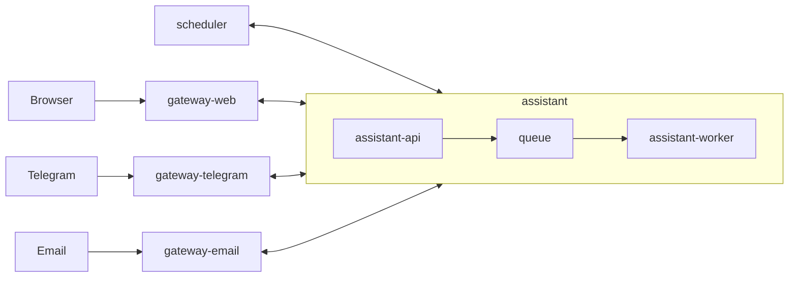

# MyConcierge

MyConcierge is a personal home assistant for one user.
It is a small and minimal alternative to heavier systems like OpenClaw.

## Principles

- Minimal resource usage
- Clear architecture and relationships
- Minimal runtime components
- Run well on home infrastructure
- Stay easy to extend later

## Planned Runtime

- Docker Compose as default runtime
- Docker for single-container cases
- Kubernetes
- Kubernetes CronJob for scheduled tasks

## Tech Direction

- Node.js
- TypeScript with strict mode
- NestJS
- Environment-based configuration
- Multiple LLM providers: DeepSeek, xAI, OpenAI, and Ollama
- Extensible LLM provider layer for future providers
- Prometheus metrics

## Repository Status

This repository now contains implemented services: `gateway-web`, `assistant-api`, and `assistant-worker`.
The rest of the system is still described by documentation.
The current source of truth is the code for these services and the project documentation for the wider system.

## Documents

- [Project instructions](./AGENTS.md)
- [Overview](./docs/overview.md)
- [Requirements](./docs/requirements.md)
- [Runtime architecture](./docs/architecture/runtime.md)
- [System components](./docs/architecture/components.md)
- [Data flow](./docs/architecture/data-flow.md)
- [Repository layout](./docs/architecture/repository-layout.md)
- [Application endpoints](./docs/contracts/application-endpoints.md)
- [Docker Compose](./docs/deployment/docker-compose.md)
- [Assistant](./docs/services/assistant.md)
- [Metrics](./docs/operations/metrics.md)
- [Swagger](./docs/services/swagger.md)

## Implemented Scope

- Local runtime named `assistant`
- Core backend split into `assistant-api` and `assistant-worker`
- Queue-based asynchronous flow between `assistant-api` and `assistant-worker`
- `assistant-api` accepts requests, validates them, enqueues jobs, and acknowledges them
- `assistant-api` supports env-based queue adapters and currently uses Redis by default through `QUEUE_ADAPTER=redis`
- `assistant-worker` reads queued jobs and sends simple callback replies
- `gateway-web` provides the browser chat UI and WebSocket transport
- `gateway-web` exposes `/`, `WS /ws`, `/callbacks/assistant/:contact`, `/status`, `/metrics`, and `/openapi.json`
- `assistant-api`, `assistant-worker`, and `gateway-web` expose `/status`, `/metrics`, and OpenAPI documentation
- One shared Swagger UI aggregates the service schemas
- Default local runtime is Docker Compose
- The system is prepared for home deployment and future horizontal scaling

## Service Structure

- [`assistant`](./docs/services/assistant.md): core backend component
  - [`assistant-api`](./docs/services/assistant-api.md): receives inbound requests from channels, validates payloads, enqueues work, and returns acceptance responses
  - [`queue`](./docs/services/queue.md): buffers work between `assistant-api` and `assistant-worker`
  - [`assistant-worker`](./docs/services/assistant-worker.md): reads queued jobs, executes background processing, and sends callback replies to the originating channel
- `gateways`: channel adapters that accept inbound user traffic and forward it into `assistant`
  - [`gateway-web`](./docs/services/gateway-web.md): serves the browser chat UI and accepts WebSocket messages from the browser
  - [`gateway-telegram`](./docs/services/gateway-telegram.md): accepts inbound Telegram messages
  - [`gateway-email`](./docs/services/gateway-email.md): accepts inbound email messages
- [`scheduler`](./docs/services/scheduler.md): creates scheduled requests and sends them into `assistant`



## Metrics

Detailed metrics documentation lives in [docs/operations/metrics.md](./docs/operations/metrics.md).
It contains the metrics flow diagram and per-service metric tables.

## Swagger

Detailed Swagger documentation lives in [docs/services/swagger.md](./docs/services/swagger.md).

## Local Ports

| Host port | Service | Purpose |
|---------|-------------|---------|
| [http://localhost:3000/](http://localhost:3000/) | [`assistant-api`](./docker-compose.yaml) | HTTP API |
| [http://localhost:3001/](http://localhost:3001/) | [`assistant-worker`](./docker-compose.yaml) | Worker service |
| [http://localhost:8080/](http://localhost:8080/) | [`gateway-web`](./docker-compose.yaml) | Web chat UI, WebSocket, callbacks |
| [http://localhost:8081/](http://localhost:8081/) | [`gateway-telegram`](./docker-compose.yaml) | Telegram gateway |
| [http://localhost:8082/](http://localhost:8082/) | [`gateway-email`](./docker-compose.yaml) | Email gateway |
| [http://localhost:8088/](http://localhost:8088/) | [`swagger`](./docker-compose.yaml) | Shared Swagger UI |

Notes:

- `queue` is internal-only in the current local `docker-compose` and is not exposed on a host port.
- `scheduler` does not publish a host port in the current local `docker-compose`.
- All app containers use internal port `3000`.

## Run

1. Install Docker and Docker Compose.
2. Start the local stack:

```bash
make up
```

3. Open the main entrypoints:

- [http://localhost:8080/](http://localhost:8080/) for `gateway-web`
- [http://localhost:8088/](http://localhost:8088/) for `swagger`

4. Stop the stack:

```bash
make down
```

## Documentation Structure

- `docs/requirements.md`: high-level requirements
- `docs/architecture/`: runtime and component design
- `docs/services/`: service-by-service docs
- `docs/contracts/`: API and queue contracts
- `docs/deployment/`: runtime and deployment docs
- `docs/operations/`: observability and scaling docs

## Local Commands

- `make build`: build local `assistant-api`, `assistant-worker`, and `gateway-web` Docker images
- `make up`: start local `assistant-api`, `assistant-worker`, and `gateway-web`
- `make down`: stop the local Docker Compose stack
- `npm run build`: build the NestJS service
- `npm test`: run unit tests
- `npm run test:e2e`: run e2e tests

## GitHub Automation

- `PR Auto-merge`: runs `npm ci`, `npm run build`, `npm run test:all`, `docker compose config`, and `docker compose build assistant-api assistant-worker gateway-web`, then auto-merges matching PRs to `main`
- `Main Release`: on `push` to `main`, repeats validation, computes the next semver tag from the merged PR branch prefix, creates the git tag, and publishes a GitHub Release
- `Tag Image`: on push of a `v*` tag, repeats validation and publishes `gateway-web` to `ghcr.io/<owner>/my-concierge-gateway-web`

## Runtime Directory

The local runtime is named `assistant`.
It is split into `assistant-api` and `assistant-worker`.
Both parts should start inside the working directory that contains the runtime files.
Both parts read the core runtime files before serving API traffic or processing queued work.

Expected runtime files and folders:

- `AGENTS.md`
- `SOUL.md`
- `IDENTITY.md`
- `skills/`
- `memory/`

## Out of Scope for First Version

- Multi-user support
- Authentication and authorization
- Complex UI
- Large infrastructure setup

## Next Step

Build the first MVP around one real user workflow and keep the system small.
