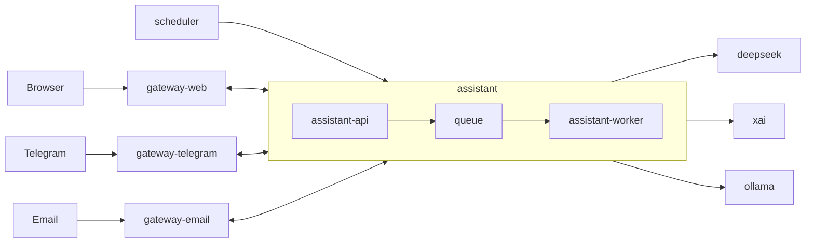

# MyConcierge

MyConcierge is a personal home assistant for one user.
It is a small and minimal alternative to heavier systems like OpenClaw.

## Principles

- Minimal resource usage
- Clear architecture and relationships
- Minimal runtime components
- Run well on home infrastructure
- Stay easy to extend later

## Planned Runtime

- Docker Compose as default runtime
- Docker for single-container cases
- Kubernetes
- Kubernetes CronJob for scheduled tasks

## Tech Direction

- Node.js
- TypeScript with strict mode
- NestJS
- Environment-based configuration
- Multiple LLM providers: DeepSeek, xAI, OpenAI, and Ollama
- Extensible LLM provider layer for future providers
- Prometheus metrics

## Repository Status

This repository now contains implemented services: `gateway-web`, `assistant-api`, and `assistant-worker`.
The rest of the system is still described by documentation.
The current source of truth is the code for these services and the project documentation for the wider system.

## Documents

- [Project instructions](./AGENTS.md)
- [Overview](./docs/overview.md)
- [Requirements](./docs/requirements.md)
- [Runtime architecture](./docs/architecture/runtime.md)
- [System components](./docs/architecture/components.md)
- [Data flow](./docs/architecture/data-flow.md)
- [Repository layout](./docs/architecture/repository-layout.md)
- [Application endpoints](./docs/contracts/application-endpoints.md)
- [assistant-worker system prompt](./docs/contracts/assistant-worker-system-prompt.md)
- [Docker Compose](./docs/deployment/docker-compose.md)
- [Assistant](./docs/services/assistant.md)
- [Metrics](./docs/operations/metrics.md)
- [Swagger](./docs/services/swagger.md)

## Implemented Scope

- Local runtime named `assistant`
- Core backend split into `assistant-api` and `assistant-worker`
- Queue-based asynchronous flow between `assistant-api` and `assistant-worker`
- `assistant-api` accepts requests, validates them, enqueues jobs, and acknowledges them
- `assistant-api` supports env-based queue adapters and currently uses Redis by default through `QUEUE_ADAPTER=redis`
- `assistant-worker` reads queued jobs, loads runtime context from `runtime/assistant-worker/`, sends them to the configured provider (`deepseek`, `xai`, or `ollama`), returns callback replies, and exposes a worker settings page with provider status
- `gateway-web` provides the browser chat UI, persists browser chat history in `runtime/gateway-web/`, and uses a cookie-backed session id
- `gateway-web` exposes `/`, `WS /ws`, `/callbacks/assistant/:contact`, `/status`, `/metrics`, and `/openapi.json`
- `assistant-api`, `assistant-worker`, and `gateway-web` expose `/status`, `/metrics`, and OpenAPI documentation
- One shared Swagger UI aggregates the service schemas
- Default local runtime is Docker Compose
- The system is prepared for home deployment and future horizontal scaling

## Services

### Structure

- [assistant](./docs/services/assistant.md): core backend component that includes [assistant-api](./docs/services/assistant-api.md), [queue](./docs/services/queue.md), and [assistant-worker](./docs/services/assistant-worker.md)
- gateway: channel-facing layer that includes [gateway-web](./docs/services/gateway-web.md), [gateway-telegram](./docs/services/gateway-telegram.md), and [gateway-email](./docs/services/gateway-email.md)
- [scheduler](./docs/services/scheduler.md): scheduled trigger component that only sends requests into `assistant`



### assistant-api

- [assistant-api](./docs/services/assistant-api.md): receives inbound requests, validates them, enqueues work, and exposes operational endpoints without sending replies back to gateways

### assistant-worker

- [assistant-worker](./docs/services/assistant-worker.md): processes queued jobs, calls the configured LLM provider, sends callback replies, and exposes operational endpoints plus provider status

### assistant

- [assistant](./docs/services/assistant.md): groups `assistant-api`, `queue`, and `assistant-worker` into the core backend component

### queue

- [queue](./docs/services/queue.md): transports work from `assistant-api` to `assistant-worker`

### gateway-web

- [gateway-web](./docs/services/gateway-web.md): serves the browser chat UI and bridges browser traffic to `assistant`

### gateway-telegram

- [gateway-telegram](./docs/services/gateway-telegram.md): planned Telegram adapter for inbound messages and assistant replies

### gateway-email

- [gateway-email](./docs/services/gateway-email.md): planned Email adapter for inbound messages and assistant replies

### scheduler

- [scheduler](./docs/services/scheduler.md): planned scheduled trigger component that only sends requests into `assistant`

### swagger

- [swagger](./docs/services/swagger.md): serves one shared Swagger UI for the runtime services

## Metrics

Detailed metrics documentation lives in [docs/operations/metrics.md](./docs/operations/metrics.md).
It contains the metrics flow diagram and per-service metric tables.

## Local Ports

| Host port | Service | Purpose |
|---------|-------------|---------|
| [http://localhost:3000/](http://localhost:3000/) | [`assistant-api`](./docker-compose.yaml) | HTTP API |
| [http://localhost:3001/](http://localhost:3001/) | [`assistant-worker`](./docker-compose.yaml) | Worker settings page, provider status, and service |
| [http://localhost:8080/](http://localhost:8080/) | [`gateway-web`](./docker-compose.yaml) | Web chat UI, WebSocket, callbacks |
| [http://localhost:8081/](http://localhost:8081/) | [`gateway-telegram`](./docker-compose.yaml) | Telegram gateway |
| [http://localhost:8082/](http://localhost:8082/) | [`gateway-email`](./docker-compose.yaml) | Email gateway |
| [http://localhost:8088/](http://localhost:8088/) | [`swagger`](./docker-compose.yaml) | Shared Swagger UI |

Notes:

- `queue` is internal-only in the current local `docker-compose` and is not exposed on a host port.
- `scheduler` does not publish a host port in the current local `docker-compose`.
- All app containers use internal port `3000`.

## Run

1. Install Docker and Docker Compose.
2. Create the local env file:

```bash
make env
```

3. Configure one provider in `.env`.

For `deepseek`:
- `DEEPSEEK_API_KEY`

For `xai`:
- `XAI_API_KEY`

For local Ollama:
- `OLLAMA_BASE_URL=http://host.docker.internal:11434`
- `OLLAMA_MODEL=gemma3:1b`

4. If you want `deepseek` or `ollama` instead of `xai`, open [http://localhost:3001/](http://localhost:3001/) after startup and switch the worker provider there.

5. Start the local stack:

```bash
make up
```

6. Open the main entrypoints:

- [http://localhost:8080/](http://localhost:8080/) for `gateway-web`
- [http://localhost:8088/](http://localhost:8088/) for `swagger`

7. Stop the stack:

```bash
make down
```

## Documentation Structure

- `docs/requirements.md`: high-level requirements
- `docs/architecture/`: runtime and component design
- `docs/services/`: service-by-service docs
- `docs/contracts/`: API and queue contracts
- `docs/deployment/`: runtime and deployment docs
- `docs/operations/`: observability and scaling docs

## Local Commands

- `make env`: create `.env` from `.env.example` if it does not exist
- `make build`: build local `assistant-api`, `assistant-worker`, and `gateway-web` Docker images
- `make up`: start local `assistant-api`, `assistant-worker`, and `gateway-web`
- `make down`: stop the local Docker Compose stack
- `npm run build`: build the NestJS service
- `npm test`: run unit tests
- `npm run test:e2e`: run e2e tests

## GitHub Automation

- `PR Auto-merge`: runs `npm ci`, `npm run build`, `npm run test:all`, `docker compose config`, and `docker compose build assistant-api assistant-worker gateway-web`, then auto-merges matching PRs to `main`
- `Main Release`: on `push` to `main`, repeats validation, computes the next semver tag from the merged PR branch prefix, creates the git tag, and publishes a GitHub Release
- `Tag Image`: on push of a `v*` tag, repeats validation and publishes `gateway-web` to `ghcr.io/<owner>/my-concierge-gateway-web`

## Runtime Directory

The local runtime is named `assistant`.
It is split into `assistant-api` and `assistant-worker`.
The repository contains separate runtime directories under `runtime/`.
In Docker Compose, each service mounts only its own runtime directory:
- `assistant-worker`: `./runtime/assistant-worker:/app/runtime`
- `gateway-web`: `./runtime/gateway-web:/app/runtime`
The runtime directory is not baked into the Docker image.

Expected runtime files and folders:

- `runtime/assistant-worker/SYSTEM.js`
- `runtime/assistant-worker/SOUL.js`
- `runtime/assistant-worker/IDENTITY.js`
- `runtime/assistant-worker/skills/`
- `runtime/assistant-worker/memory/`
- `runtime/assistant-worker/conversations/`
- `runtime/assistant-worker/config/`
- `runtime/gateway-web/conversations/`

The repository already includes a starter runtime directory in [runtime/](/Users/vinitu/Projects/vinitu/my-concierge/runtime) with placeholder instruction files.
The repository-owned worker prompt template lives in [prompts/user-prompt.md](/Users/vinitu/Projects/vinitu/my-concierge/prompts/user-prompt.md).

## Out of Scope for First Version

- Multi-user support
- Authentication and authorization
- Complex UI
- Large infrastructure setup

## Next Step

Build the first MVP around one real user workflow and keep the system small.
