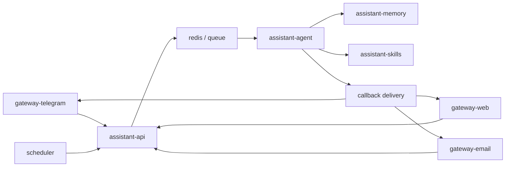

# Agent Runtime Redesign

## Goal

Define a new architecture where `assistant` keeps a thin API layer, moves orchestration into `assistant-agent`, moves memory into `assistant-memory`, and uses LangChain.js as the only agent runtime for now.

## Problem

The current design puts too many responsibilities into `assistant-worker`.
Right now it mixes:

- queue consumption
- conversation state handling
- runtime context loading
- prompt assembly
- LLM execution
- callback delivery

This is acceptable for V1, but it becomes unclear once the system needs:

- real agent loops
- planning and routing
- fan-out and fan-in
- durable memory
- retrieval and summarization
- specialized executors for different types of work

## Design Goals

- Keep `assistant-api` thin.
- Keep gateways thin.
- Introduce one execution brain: `assistant-agent`.
- Introduce one memory brain: `assistant-memory`.
- Keep `assistant-worker-*` focused on narrow execution tasks.
- Use LangChain.js as the only agent loop runtime in the near term.
- Preserve queue-based intake and callback-based reply delivery.
- Keep the architecture small enough for Docker Compose and home infrastructure.

## Non-Goals

- Multi-user support
- Auth and authorization in the first version
- Claude Code integration
- Heavy workflow orchestration platforms
- Provider-specific logic inside gateways

## Proposed Topology



## Main Decision

The system should be split into three kinds of backend logic:

1. orchestration logic in `assistant-agent`
2. memory logic in `assistant-memory`
3. specialized execution logic in `assistant-worker-*`

`assistant-agent` is the central decision-maker.
It owns the agent loop, planning, routing, aggregation, and final execution decisions.

`assistant-memory` is the single source of truth for durable memory.
It owns retrieval, memory writes, summaries, profile updates, and compaction.

`assistant-worker-*` services are narrow executors.
They do not own orchestration and they do not write canonical memory directly.

## Component Responsibilities

### `assistant-api`

- accept inbound requests from gateways and scheduler
- validate payloads
- assign request id and metadata
- enqueue orchestration jobs
- return acceptance response
- stay independent from LangChain.js and worker internals

### `assistant-agent`

`assistant-agent` is the execution brain of the system.

Responsibilities:

- read orchestration jobs from the queue
- load current conversation state
- retrieve relevant memory context from `assistant-memory`
- run the LangChain.js agent loop
- decide the next step in the run
- select which workers to call
- choose sequential or parallel execution
- aggregate worker outputs
- synthesize the final answer
- decide which memory candidates should be persisted
- send canonical memory writes to `assistant-memory`
- send the final callback to the originating gateway
- expose status and metrics

What must not live in `assistant-agent`:

- heavy local skill execution
- durable memory storage
- scheduler logic
- gateway-specific transport logic

### `assistant-memory`

`assistant-memory` is the memory brain of the system.

Responsibilities:

- store profile memory
- store preferences and recurring facts
- store episodic memory
- store conversation summaries
- retrieve relevant context for a run
- support semantic search, keyword search, and recency ranking
- validate and persist canonical memory writes
- compact and deduplicate memory
- update profile and summaries over time

`assistant-memory` should be the only canonical write path for durable memory.

### `assistant-worker-*`

`assistant-worker-*` services are specialized executors.

Examples:

- `assistant-skills`

Shared rules:

- execute a narrow type of task
- return structured results
- may suggest memory candidates
- must not write durable memory directly
- must not own the global agent loop
- must not aggregate final answers across the whole run

### `scheduler`

- create scheduled triggers
- submit work through `assistant-api`
- never call workers or memory directly

### `redis / queue`

- transport orchestration jobs from `assistant-api` to `assistant-agent`
- optionally transport worker jobs if internal fan-out also uses the queue
- preserve retry-safe contracts and idempotency keys

## LangChain.js Role

LangChain.js is the only agent runtime for now.

It should live inside `assistant-agent` and provide:

- agent loop execution
- planner and router primitives
- tool invocation integration
- branching orchestration support
- structured output parsing where useful

The system should not introduce a separate `agent-claude` service right now.
If another runtime is needed later, it can be introduced behind the same `assistant-agent` boundary instead of becoming a separate top-level brain.

## What Lives In `assistant-agent`

### 1. Agent Loop

The main loop belongs here:

1. receive input
2. read conversation state
3. retrieve memory context
4. decide next action
5. call worker, tool, or skill
6. receive observation
7. decide whether to continue
8. produce final answer

### 2. Planner And Router

`assistant-agent` decides:

- which workers are needed
- which work is sequential
- which work is parallel
- whether fan-out is useful
- when enough information exists to finish the response

### 3. Aggregation

After parallel branches, `assistant-agent` must:

- collect branch results
- remove duplicates
- normalize result fields
- build one synthesis for the final answer

### 4. Execution Policies

`assistant-agent` owns:

- max loop steps
- timeout per branch
- retry policy
- partial completion policy
- model fallback policy

## What Lives In `assistant-memory`

### 1. Long-Term Memory

- user profile
- preferences
- recurring facts
- important rules
- explicit saved memories

### 2. Episodic Memory

- what was discussed
- what actions were performed
- what plans were made
- conversation chunk summaries

### 3. Retrieval

- semantic search
- keyword search
- recency ranking
- filtering by tags, source, and time

### 4. Memory Write Policy

Workers should not write memory directly.

The flow should be:

1. worker returns a memory candidate
2. `assistant-agent` decides whether it is worth saving
3. `assistant-memory` performs the canonical write

### 5. Summarization And Compaction

`assistant-memory` should support:

- compaction
- deduplication
- summary rebuild
- profile updates

## State Types

The redesign should explicitly separate at least four state types.

### `conversation state`

- current dialog
- pending turn
- compact rolling summary
- recent visible messages

### `agent execution state`

- loop steps
- branch plans
- observations
- retries
- timeouts
- final run status

### `memory state`

- profile
- facts
- episodes
- summaries
- retrieved context

### `worker result state`

- structured outputs from workers
- execution metadata
- tool outputs
- memory candidates

These states must not be merged into one generic blob.

## Suggested Service Boundaries

### `gateway-telegram`

- Telegram updates
- Telegram replies
- typing and status updates

### `gateway-web`

- browser transport
- WebSocket updates
- callback handling for browser sessions

### `assistant-api`

- request validation
- request id
- enqueue orchestration job

### `assistant-agent`

- LangChain.js agent loop
- next-step planning
- fan-out and fan-in
- result aggregation
- final response draft
- memory write decisions

### `assistant-memory`

- profile
- episodic memory
- retrieval
- summaries
- semantic search
- canonical writes

### `assistant-skills`

- local skills
- scripts
- shell execution
- integrations

## Data Flow

Main flow:

```text
gateway -> assistant-api -> queue -> assistant-agent -> callback target
```

Expanded flow:

```text
gateway
  -> assistant-api
  -> redis / queue
  -> assistant-agent
       -> assistant-memory
       -> assistant-skills
  -> gateway callback
```

## Storage Proposal

### Durable Memory

`assistant-memory` should own durable storage.

Recommended first implementation:

- PostgreSQL as the main store
- `pgvector` for semantic retrieval
- relational tables for metadata, scope, and audit fields

Why this fits:

- one storage system for structured and semantic memory
- simpler than mixing SQL plus a separate vector database
- works well in Docker Compose and Kubernetes

### Runtime Files

These should remain file-based:

- bootstrap identity files
- skill definitions
- development fixtures

These should move out of runtime files and into canonical storage:

- learned preferences
- task history
- episodic summaries
- extracted facts from executions

## Scaling Model

This split works well for multiple Raspberry devices.

### `assistant-agent`

- prefer one active instance
- optionally leader plus standby
- keep orchestration centralized

### `assistant-memory`

- can run centrally on one Raspberry
- owns the durable database
- serves retrieval to the active `assistant-agent`

### `assistant-worker-*`

- can be distributed across Raspberry devices
- can scale independently by specialization
- can be added incrementally as new execution domains appear

## Migration Plan

### Phase 1

- keep `assistant-api` unchanged as the thin intake boundary
- introduce `assistant-agent` as the new queue consumer
- move current orchestration logic out of `assistant-worker`

### Phase 2

- integrate LangChain.js into `assistant-agent`
- implement loop, planner, routing, and aggregation there
- keep final phrasing inside `assistant-agent`

### Phase 3

- introduce `assistant-memory`
- move durable memory, retrieval, summaries, and profile updates there
- keep runtime files only for bootstrap identity and skills

### Phase 4

- split specialized executors into `assistant-worker-*`
- start with `assistant-skills` only
- add other worker types later only when a clear execution domain appears

### Phase 5

- add richer observability for agent steps, branch fan-out, memory retrieval, and worker execution
- update Docker Compose and Kubernetes documents

## Risks

- `assistant-agent` can become a new monolith if internal modules are not kept separate.
- Parallel branches can create difficult retry and deduplication rules.
- Memory writes can become noisy without strict save policies.
- Worker boundaries can be too fine-grained and add overhead if split too early.

## Open Questions

- Should worker fan-out use direct service calls or internal queue jobs?
- Is `assistant-skills` enough for the first real implementation?
- How much conversation state should stay in `assistant-agent` versus `assistant-memory`?
- Does `assistant-memory` start as a service immediately or as a module backed by PostgreSQL?

## Recommended Decision Summary

- Keep `assistant-api` as the thin intake boundary.
- Replace the old worker-centered design with `assistant-agent` as the orchestration brain.
- Introduce `assistant-memory` as the memory brain and canonical durable memory layer.
- Use LangChain.js only, inside `assistant-agent`.
- Treat `assistant-worker-*` as specialized executors, not decision-makers.
- Keep conversation state, execution state, memory state, and worker result state separate.
