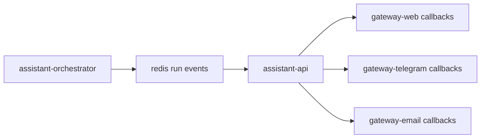

# Callback Architecture

## Goal

Describe how assistant replies leave the core runtime and return to gateways.

## Ownership Rule

`assistant-api` owns all external callback delivery.

That means:

- gateways send requests into `assistant-api`
- `assistant-orchestrator` publishes run events only
- `assistant-api` consumes those events and performs callbacks

## Relations



## Callback Flow

1. `assistant-orchestrator` publishes `run.thinking`, `run.completed`, or `run.failed`.
2. `assistant-api` reads the event from Redis.
3. `assistant-api` resolves the callback target from stored routing metadata.
4. `assistant-api` sends the matching callback request to the gateway.
5. The gateway translates that callback into the final channel delivery.

## Gateway Mapping

### `gateway-web`

- `POST /thinking/:conversationId`
- `POST /tool/:conversationId`
- `POST /response/:conversationId`

### `gateway-telegram`

- `POST /thinking/:conversationId`
- `POST /tool/:conversationId`
- `POST /response/:conversationId`

### `gateway-email`

- `POST /thinking/:conversationId`
- `POST /tool/:conversationId`
- `POST /response/:conversationId`

## Callback Payload Types

Thinking payload:

```json
{
  "seconds": 2
}
```

Final response payload:

```json
{
  "message": "I received your message."
}
```

Failure payload:

```json
{
  "message": "The assistant run failed.",
  "code": "RUN_FAILED"
}
```

## Callback Rules

- `assistant-orchestrator` never calls gateway callback endpoints directly
- callback retries belong to `assistant-api`
- gateways must tolerate duplicate callback delivery
- final delivery semantics are channel-specific inside gateways
- callback payloads must be derived from run events, not from direct worker-to-gateway calls
- `gateway-telegram` must map callbacks to its local chat runtime before sending channel-native replies
- `gateway-email` must map callbacks to its local mailbox runtime before sending channel-native replies

## Retry And Idempotency Rules

- callback deliveries are keyed by `runId + eventType + sequence`
- `assistant-api` retries failed deliveries with the same payload
- gateways must ignore duplicate deliveries for keys they already applied
- terminal callbacks must remain stable across retries

## Related Documents

- [Data Flow](./data-flow.md)
- [Callback API Contract](../contracts/callback-api.md)
- [assistant-api](../services/assistant/assistant-api.md)
