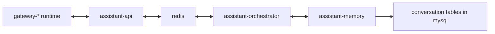
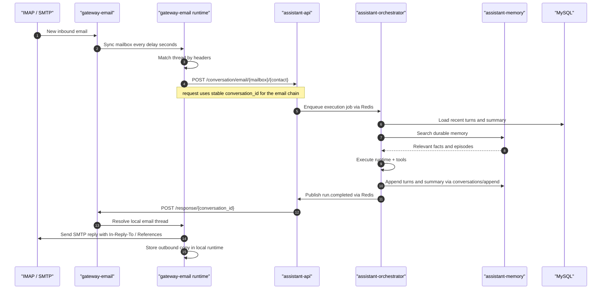

# Conversation

## Goal

Describe how conversation state works across gateways, `assistant-api`, `assistant-orchestrator`, and MySQL.

## Ownership Model

- gateways own channel-native session or thread state
- `assistant-api` owns intake validation and callback routing metadata
- `assistant-memory` owns canonical conversation state
- MySQL is the canonical storage backend for conversation threads, turns, and summaries via `assistant-memory`

This split is important:

- gateways keep only transport-local runtime state
- `assistant-memory` keeps the assistant-visible canonical conversation state
- durable memory is separate and is owned by `assistant-memory`

## Relations

## Conversation Identity

Each conversation has one stable `conversation_id`.

Rules:

- the gateway creates or resolves the `conversation_id`
- the same `conversation_id` must be reused for the same user-visible thread
- `assistant-api` treats `conversation_id` as opaque and stable
- `assistant-memory` uses `conversation_id` as the canonical thread id in MySQL

Examples:

- `gateway-web`: browser conversation id from cookie
- `gateway-telegram`: telegram chat or thread mapping
- `gateway-email`: email thread mapping derived from `Message-ID`, `In-Reply-To`, and `References`

## Conversation State

Canonical conversation state contains:

- thread metadata
- recent turns
- compact conversation summary
- timestamps and status

It does not contain:

- gateway transport credentials
- IMAP or SMTP state
- full durable memory
- tool execution internals beyond what is reflected in turns or summary

## Read Path

1. A gateway accepts an inbound user message.
2. The gateway resolves the stable `conversation_id`.
3. The gateway sends the normalized message to `assistant-api`.
4. `assistant-api` validates the request and writes an execution job to Redis.
5. `assistant-orchestrator` reads the job from Redis.
6. `assistant-orchestrator` loads the conversation summary and recent turns from `assistant-memory`.
7. `assistant-orchestrator` calls `assistant-memory` only for durable memory retrieval.
8. `assistant-orchestrator` sends messages-based context to `assistant-llm` for main generation.

## Write Path

1. `assistant-llm` returns the final answer (directly or after tool synthesis).
2. `assistant-orchestrator` appends the user turn and assistant turn through `assistant-memory`.
3. `assistant-memory` updates the compact conversation summary in MySQL.
4. `assistant-orchestrator` emits run events to Redis.
5. `assistant-api` consumes the run events and sends the external callback to the originating gateway.
6. The gateway updates its own local transport runtime.

## Separation Rules

- conversation state is not durable memory
- gateways do not own canonical assistant conversation history
- `assistant-api` does not store or mutate canonical conversation turns
- `assistant-memory` owns canonical conversation threads and summaries
- channel-native thread state may exist in the gateway, but assistant-visible thread state lives in `assistant-memory`

## Email Thread Example

For `gateway-email`, one email chain should map to one stable `conversation_id`.

Threading rules:

- inbound emails are matched by `Message-ID`, `In-Reply-To`, and `References`
- the local gateway runtime stores mailbox copies and thread metadata like a mail client
- replies must preserve `In-Reply-To` and `References`
- the assistant-visible conversation still uses one canonical `conversation_id`

## Canonical Tables

The canonical conversation tables are:

- `conversation_threads`
- `conversation_turns`
- `conversation_summaries`

See the schema in [Persistence Schema](./persistence-schema.md).

## Related Documents

- [Data Flow](./data-flow.md)
- [Memory](./memory.md)
- [Persistence Schema](./persistence-schema.md)
- [Conversation API Contract](../contracts/conversation-api.md)
- [assistant-orchestrator](../services/assistant/assistant-orchestrator.md)
