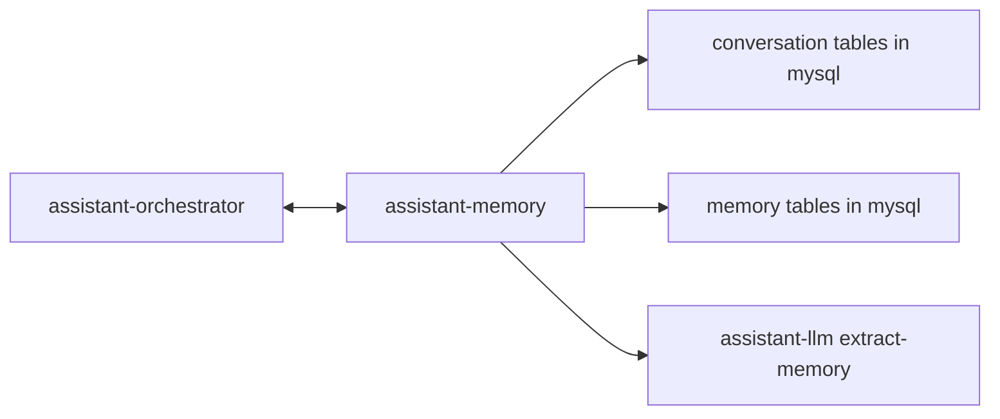

# Memory

## Goal

Describe how durable memory and conversation-enrichment memory work across `assistant-orchestrator`, `assistant-memory`, `assistant-llm`, and MySQL.

## Ownership Model

- `assistant-memory` owns canonical conversation state
- `assistant-memory` owns durable memory state
- `assistant-orchestrator` owns runtime orchestration only
- MySQL is the canonical storage backend for both domains

This split is important:

- conversation state is run-local and thread-local
- durable memory is cross-run and long-lived

## Relations

## Memory Types

`assistant-memory` owns these memory domains:

- `profile`
- `preference`
- `fact`
- `routine`
- `project`
- `episode`
- `rule`

### `profile`

Definition:

- the singleton structured profile for the user or household
- contains stable top-level attributes used across many runs
- is stored as the dedicated `user_profile` record, not as a generic memory entry

Examples:

- `language = "en"`
- `timezone = "Europe/Warsaw"`
- `home.city = "Warsaw"`
- `preferences.response_style = "concise"`

### `preference`

Definition:

- a stable user preference, taste, or recurring style choice
- should affect future suggestions or answer formatting
- should not be used for one-off decisions

Examples:

- `Prefers concise replies`
- `Prefers Telegram over email for quick messages`
- `Usually buys groceries from Biedronka`

### `fact`

Definition:

- a stable factual statement about the user, household, accounts, or devices
- expected to remain true until explicitly changed
- should be objective rather than interpretive

Examples:

- `Uses a Synology NAS at home`
- `Primary work OS is macOS`
- `Has gateway-web enabled in the current setup`

### `routine`

Definition:

- a repeated pattern, schedule, or habitual workflow
- should represent recurring behavior, not just a single future task
- may influence reminders, timing, and proactive suggestions

Examples:

- `Checks email every morning before work`
- `Reviews household expenses every Sunday`
- `Runs weekly infrastructure maintenance on Friday evening`

### `project`

Definition:

- a longer-lived initiative with evolving state across multiple conversations
- should be used when future turns need the current project context
- may be updated multiple times as the project progresses

Examples:

- `Agent runtime redesign for MyConcierge`
- `Setting up gateway-email with IMAP and SMTP sync`
- `Migrating assistant persistence from file storage to MySQL`

### `episode`

Definition:

- a summarized memory of a specific past event, decision, or discussion
- useful because it may matter later, but is not a permanent fact or preference
- should be concise and dated by context

Examples:

- `On 2026-03-27, the architecture changed so assistant-api owns all callbacks`
- `Discussed email threading and decided one email chain maps to one conversation_id`
- `Chose assistant-llm as the single generation runtime for assistant-orchestrator and enrichment`

### `rule`

Definition:

- an explicit instruction, constraint, or policy the assistant must obey
- may come directly from the user or from system architecture decisions
- should be high-priority during retrieval and response generation

Examples:

- `Use MySQL instead of PostgreSQL`
- `Only assistant-api may deliver external callbacks`
- `Do not store speculative memories`

## Read Path

1. `assistant-orchestrator` starts a run from a queued job.
2. `assistant-orchestrator` loads the conversation summary and recent turns from MySQL.
3. `assistant-orchestrator` calls `assistant-memory` with a retrieval query.
4. `assistant-memory` ranks relevant entries and returns a filtered result set.
5. `assistant-orchestrator` injects only top relevant memory into the messages context sent to `assistant-llm`.

## Write Path

1. Main generation returns final answer and optional memory candidates.
2. `assistant-orchestrator` appends conversation exchange through `assistant-memory`.
3. `assistant-memory` persists conversation turns and summary in MySQL.
4. `assistant-memory` validates and stores explicit memory writes.
5. `assistant-memory` runs asynchronous enrichment and calls `assistant-llm /v1/generate/extract-memory`.
6. `assistant-memory` applies profile patch and typed memory writes from enrichment output.

## Type Selection Rules

Use these rules when choosing the memory type:

- use `profile` for singleton structured user metadata
- use `preference` for stable likes, dislikes, and answer-style choices
- use `fact` for stable objective information
- use `routine` for recurring patterns
- use `project` for active long-running efforts
- use `episode` for notable past events or decisions
- use `rule` for instructions and constraints that must be obeyed

Do not use:

- `episode` for permanent profile settings
- `fact` for subjective preferences
- `project` for one short conversation with no ongoing state
- `routine` for a single scheduled event

## Separation Rules

- conversation summaries are not durable memory entries
- not every assistant message creates a memory entry
- `assistant-orchestrator` does not write directly to memory tables
- `assistant-memory` owns canonical conversation turns
- full memory history is never injected into the LLM context

## Retrieval Rules

- retrieval is filtered by relevance first
- recency is a ranking factor, not the only factor
- memory kind and scope may narrow the result set
- duplicate or stale entries should be compacted by `assistant-memory`

## Canonical Endpoints

The main `assistant-memory` endpoints are:

- `GET /v1/profile`
- `PUT /v1/profile`
- `POST /v1/search`
- `POST /v1/preferences/search`
- `POST /v1/preferences/write`
- `POST /v1/facts/search`
- `POST /v1/facts/write`
- `POST /v1/routines/search`
- `POST /v1/routines/write`
- `POST /v1/projects/search`
- `POST /v1/projects/write`
- `POST /v1/episodes/search`
- `POST /v1/episodes/write`
- `POST /v1/rules/search`
- `POST /v1/rules/write`
- `POST /v1/compact`
- `POST /v1/reindex`

## Related Documents

- [assistant-memory](../services/assistant/assistant-memory.md)
- [assistant-orchestrator](../services/assistant/assistant-orchestrator.md)
- [Persistence Schema](./persistence-schema.md)
- [Conversation API Contract](../contracts/conversation-api.md)
