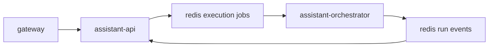

# Queue Communication

## Goal

Describe how `assistant-api` and `assistant-orchestrator` communicate through Redis in both directions.

## Transport Model

Redis is the internal transport between intake and execution.

There are two logical flows:

1. execution jobs
   - `assistant-api` writes
   - `assistant-orchestrator` reads
2. run events
   - `assistant-orchestrator` writes
   - `assistant-api` reads

## Relations

## Execution Job Flow

1. A gateway sends a message to `assistant-api`.
2. `assistant-api` validates the request.
3. `assistant-api` stores callback routing metadata.
4. `assistant-api` writes one execution job to Redis.
5. `assistant-api` returns `202 Accepted`.
6. `assistant-orchestrator` reserves the next execution job.
7. `assistant-orchestrator` processes the run.

## Run Event Flow

1. `assistant-orchestrator` publishes a run event to Redis.
2. `assistant-api` consumes the event.
3. `assistant-api` resolves the gateway callback route.
4. `assistant-api` performs callback delivery.

Supported run event types:

- `run.started`
- `run.thinking`
- `run.completed`
- `run.failed`

## Queue Message Shapes

Execution job minimum fields:

- `direction`
- `chat`
- `contact`
- `conversation_id`
- `message`
- callback routing identifiers
- `accepted_at`

Run event minimum fields:

- `runId`
- `conversationId`
- `channel`
- `eventType`
- `sequence`
- `payload`
- `createdAt`

## Queue Rules

- `assistant-api` owns enqueueing execution jobs.
- `assistant-orchestrator` owns publishing run events.
- `assistant-orchestrator` must not derive gateway callback endpoints from job payloads.
- queue messages must be idempotent enough for retries
- execution jobs and run events are separate logical streams
- queue transport stays internal and is not exposed as a public API

## Failure Handling

- if `assistant-api` fails after enqueueing, the job remains in Redis
- if `assistant-orchestrator` fails before publishing a final event, the run is incomplete and may be retried
- if callback delivery fails, the retry belongs to `assistant-api`, not to `assistant-orchestrator`

## Retry And Idempotency Rules

- each accepted request gets one stable `request_id`
- execution retries reuse the same `request_id`
- each execution attempt gets one `runId`
- all events for one attempt reuse the same `runId`
- `assistant-api` must deduplicate consumed events by `runId + sequence`
- only one terminal event is valid per `runId`

## Related Documents

- [Data Flow](./data-flow.md)
- [Queue Service](../services/queue.md)
- [Queue Message Contract](../contracts/queue-message.md)
