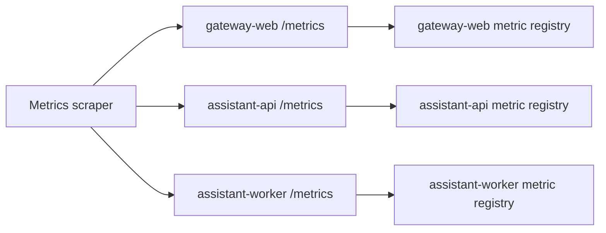

# Operations: Metrics

## Goal

Describe how metrics are exposed and which metrics each implemented service provides.

## Flow

All implemented runtime services expose Prometheus-compatible metrics through `GET /metrics`.
The current metrics flow is service-local: each service produces and serves its own metric set, and an external scraper can collect them independently.

## `gateway-web`

| Metric | Type | Labels | Description |
|---------|---------|---------|-------------|
| `gateway_web_active_websocket_sessions` | `gauge` | none | Current number of active WebSocket sessions |
| `gateway_web_incoming_messages_total` | `counter` | none | Total number of incoming WebSocket messages |
| `gateway_web_callbacks_total` | `counter` | `delivered` | Total number of callback deliveries |
| `gateway_web_assistant_api_requests_total` | `counter` | `status` | Total number of requests from `gateway-web` to `assistant-api` |
| `gateway_web_status_requests_total` | `counter` | none | Total number of status endpoint requests |
| `gateway_web_metrics_requests_total` | `counter` | none | Total number of metrics endpoint requests |

## `assistant-api`

| Metric | Type | Labels | Description |
|---------|---------|---------|-------------|
| `assistant_api_conversations_accepted_total` | `counter` | none | Total number of accepted conversation requests |
| `assistant_api_queue_messages` | `gauge` | none | Current number of messages in the queue |
| `assistant_api_status_requests_total` | `counter` | none | Total number of status endpoint requests |
| `assistant_api_metrics_requests_total` | `counter` | none | Total number of metrics endpoint requests |

## `assistant-worker`

| Metric | Type | Labels | Description |
|---------|---------|---------|-------------|
| `assistant_worker_jobs_processed_total` | `counter` | none | Total number of processed queue jobs |
| `assistant_worker_callback_requests_total` | `counter` | `status` | Total number of callback requests |
| `assistant_worker_queue_messages` | `gauge` | none | Current number of queue files visible to `assistant-worker` |
| `assistant_worker_status_requests_total` | `counter` | none | Total number of status endpoint requests |
| `assistant_worker_metrics_requests_total` | `counter` | none | Total number of metrics endpoint requests |
