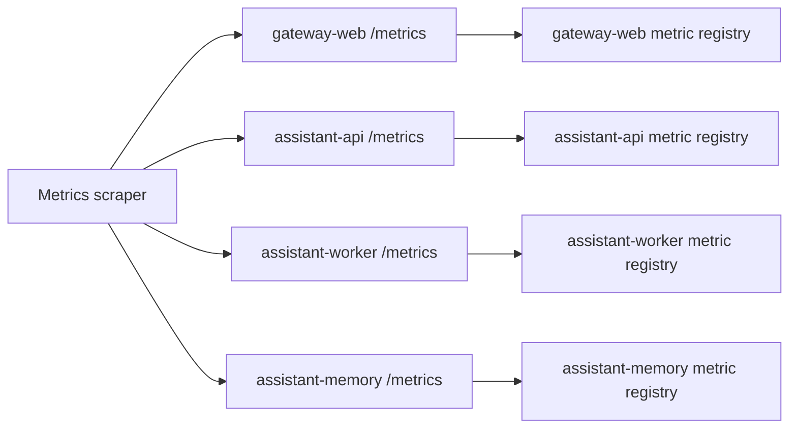

# Operations: Metrics

## Goal

Describe how metrics are exposed and which metrics each implemented service provides.

## Flow

All implemented runtime services expose Prometheus-compatible metrics through `GET /metrics`.
The current metrics flow is service-local: each service produces and serves its own metric set, and an external scraper can collect them independently.

## `gateway-web`

| Metric | Type | Labels | Description |
|---------|---------|---------|-------------|
| `http_request_time_ms` | `histogram` | `route`, `service`, `response_code` | HTTP request duration in milliseconds |
| `websocket_active_sessions` | `gauge` | `service` | Current number of active WebSocket sessions |
| `incoming_messages_total` | `counter` | `service`, `transport` | Total number of incoming messages |
| `callback_deliveries_total` | `counter` | `delivered`, `service` | Total number of callback deliveries |
| `upstream_requests_total` | `counter` | `service`, `status`, `upstream` | Total number of upstream HTTP requests |
| `endpoint_requests_total` | `counter` | `endpoint`, `service` | Total number of endpoint requests |

## `assistant-api`

| Metric | Type | Labels | Description |
|---------|---------|---------|-------------|
| `http_request_time_ms` | `histogram` | `route`, `service`, `response_code` | HTTP request duration in milliseconds |
| `accepted_messages_total` | `counter` | `service` | Total number of accepted conversation requests |
| `queue_messages` | `gauge` | `service` | Current number of messages in the queue |
| `callback_deliveries_total` | `counter` | `service`, `status` | Total number of callback deliveries |
| `endpoint_requests_total` | `counter` | `endpoint`, `service` | Total number of endpoint requests |

## `assistant-worker`

| Metric | Type | Labels | Description |
|---------|---------|---------|-------------|
| `http_request_time_ms` | `histogram` | `route`, `service`, `response_code` | HTTP request duration in milliseconds |
| `processed_jobs_total` | `counter` | `service` | Total number of processed queue jobs |
| `run_events_total` | `counter` | `service`, `event_type`, `status` | Total number of published run events |
| `queue_messages` | `gauge` | `service` | Current number of queue messages visible to `assistant-worker` |
| `endpoint_requests_total` | `counter` | `endpoint`, `service` | Total number of endpoint requests |

## `assistant-memory`

| Metric | Type | Labels | Description |
|---------|---------|---------|-------------|
| `memory_request_duration_ms` | `histogram` | `endpoint`, `response_code` | HTTP request duration in milliseconds |
| `memory_search_total` | `counter` | `kind`, `status` | Total number of memory search requests |
| `memory_write_total` | `counter` | `kind`, `status` | Total number of memory write attempts |
| `memory_archive_total` | `counter` | `kind`, `status` | Total number of archive operations |
| `memory_entries_total` | `gauge` | `kind` | Current number of active memory entries |
| `memory_compact_total` | `counter` | `status` | Total number of compaction operations |
| `memory_reindex_total` | `counter` | `status` | Total number of reindex operations |
| `memory_validation_failures_total` | `counter` | `kind`, `reason` | Total number of rejected write candidates |
