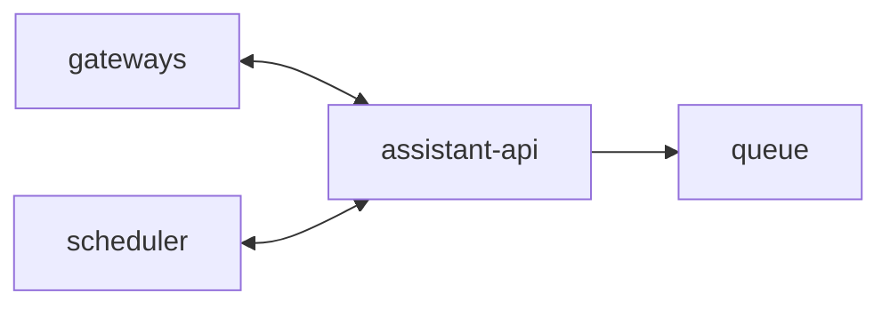

# Service: assistant-api

## Purpose

`assistant-api` is the public intake service inside `assistant`.

## Responsibilities

- Accept inbound conversation requests
- Validate request path and body
- Write accepted work to the queue
- Select the queue adapter from environment variables
- Return immediate acceptance responses
- Expose operational endpoints

## Relations

## Endpoints

| Endpoint | Purpose |
|---------|---------|
| `GET /` | Service entrypoint summary |
| `POST /conversation/{direction}/{chat}/{contact}` | Accept a conversation event |
| `GET /status` | Service readiness |
| `GET /metrics` | Prometheus metrics |
| `GET /openapi.json` | OpenAPI schema |

## Must Not Do

- Run assistant business logic
- Call LLM providers for conversation processing
- Send callback messages

## Queue Adapter

- `assistant-api` should choose its queue adapter through env
- `QUEUE_ADAPTER=redis` means Redis queue storage
- `REDIS_URL` defines the Redis connection string
- `REDIS_QUEUE_NAME` defines the Redis list name
- Redis is the current default adapter
- `QUEUE_ADAPTER=file` remains available as a fallback

## Metrics

| Metric | Type | Labels | Description |
|---------|---------|---------|-------------|
| `assistant_api_conversations_accepted_total` | `counter` | none | Total number of accepted conversation requests |
| `assistant_api_queue_messages` | `gauge` | none | Current number of messages in the queue |
| `assistant_api_status_requests_total` | `counter` | none | Total number of status endpoint requests |
| `assistant_api_metrics_requests_total` | `counter` | none | Total number of metrics endpoint requests |
