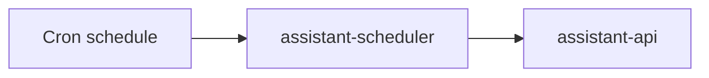

# Service: assistant-scheduler

## Purpose

`assistant-scheduler` is the scheduled trigger component for `assistant`.
It runs cron-based jobs and turns them into `assistant-api` requests.

## Responsibilities

- Run scheduled jobs
- Build scheduled request payloads for `assistant-api`
- Send scheduled requests to `assistant-api`
- Record delivery and execution trigger outcomes
- Expose operational endpoints

## Relations

## Endpoints

| Endpoint | Purpose |
|---------|---------|
| `GET /status` | Service readiness |
| `GET /metrics` | Prometheus metrics |

## Trigger Rules

- `assistant-scheduler` only creates new work
- `assistant-scheduler` does not receive assistant callbacks
- `assistant-scheduler` does not run assistant business logic
- in Kubernetes, scheduled jobs use `CronJob`

## Metrics

| Metric | Type | Labels | Description |
|---------|---------|---------|-------------|
| `http_request_time_ms` | `histogram` | `route`, `service`, `response_code` | HTTP request duration in milliseconds |
| `scheduled_jobs_total` | `counter` | `job`, `service`, `status` | Total number of scheduled jobs triggered |
| `upstream_requests_total` | `counter` | `service`, `status`, `upstream` | Total number of requests from `assistant-scheduler` to `assistant-api` |
| `endpoint_requests_total` | `counter` | `endpoint`, `service` | Total number of endpoint requests |
