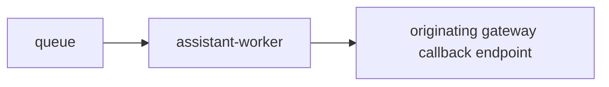

# Service: assistant-worker

## Purpose

`assistant-worker` is the queued execution service inside `assistant`.

## Responsibilities

- Read jobs from the queue
- Read jobs from Redis queue in the current implementation
- Build a simple reply from the accepted message
- Send callback messages
- Expose operational endpoints

## Relations

## Endpoints

| Endpoint | Purpose |
|---------|---------|
| `GET /` | Service entrypoint summary |
| `GET /status` | Worker readiness |
| `GET /metrics` | Prometheus metrics |
| `GET /openapi.json` | OpenAPI schema |

## Rules

- The worker does not accept public conversation requests.
- The worker reads work only from the queue.
- One queued job may produce zero, one, or many callback messages.
- The current worker logic is simple: it sends back that the message was received.
- The current worker reads Redis queue messages created by `assistant-api`.

## Metrics

| Metric | Type | Labels | Description |
|---------|---------|---------|-------------|
| `assistant_worker_jobs_processed_total` | `counter` | none | Total number of processed queue jobs |
| `assistant_worker_callback_requests_total` | `counter` | `status` | Total number of callback requests |
| `assistant_worker_queue_messages` | `gauge` | none | Current number of queue files visible to `assistant-worker` |
| `assistant_worker_status_requests_total` | `counter` | none | Total number of status endpoint requests |
| `assistant_worker_metrics_requests_total` | `counter` | none | Total number of metrics endpoint requests |
