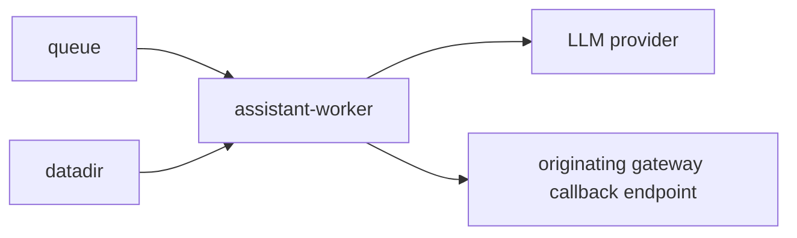
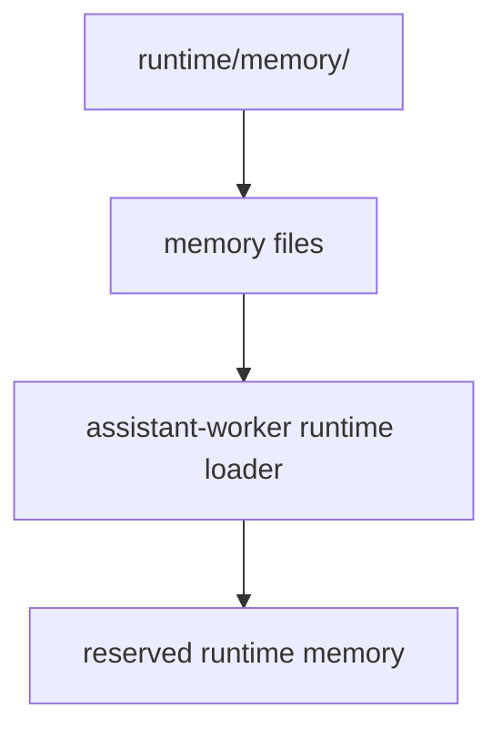
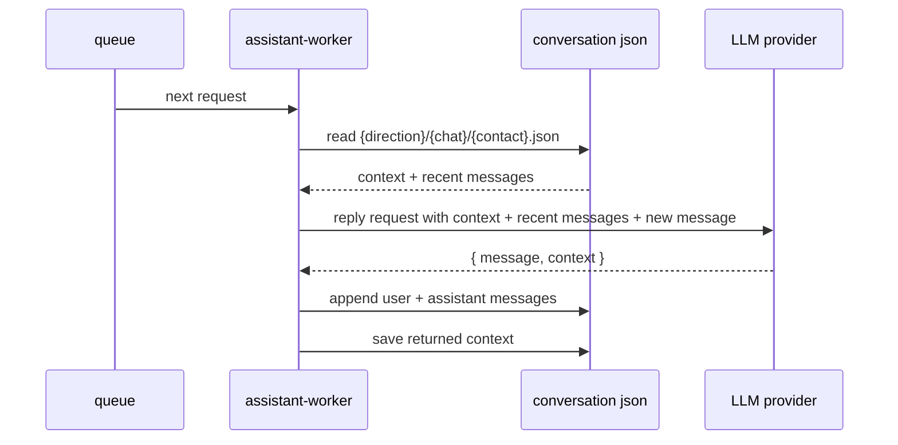
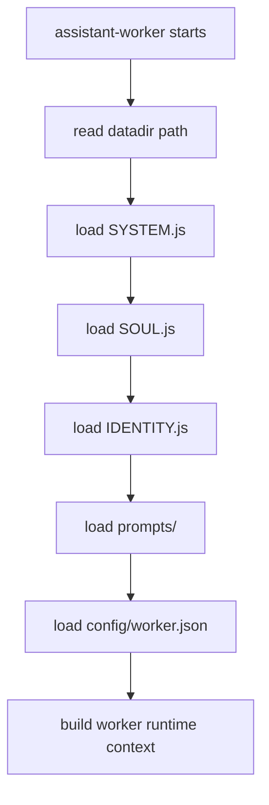
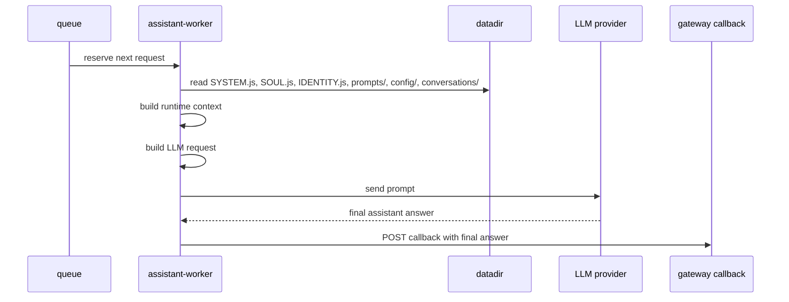
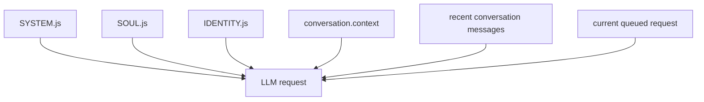
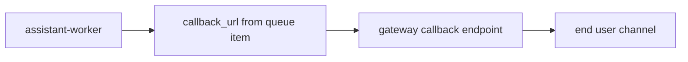

# Service: assistant-worker

## Purpose

`assistant-worker` is the queued execution service inside `assistant`.
It reads accepted requests from the queue, loads the assistant runtime context from `datadir`, sends the request to the configured LLM provider, and sends the final result back to the originating gateway through a callback.

## Status

This document describes the first worker version.
In this version, `assistant-worker` is only an LLM chat executor and does not execute local skills or local tools.
The first supported LLM providers are Grok through the xAI Responses API and local Ollama.
The worker settings page is exposed on `/`, stores config in `runtime/config/worker.json`, and shows the current provider status.
This file is runtime state and is created locally by the worker.

## Responsibilities

- Read accepted jobs from the queue
- Read the assistant runtime context from `datadir`
- Load `SYSTEM.js`, `SOUL.js`, `IDENTITY.js`, prompt templates, and conversation state
- Build the worker prompt from runtime context and queued input
- Form requests to the configured LLM provider
- Receive the final assistant answer from the LLM
- Send the final result to the callback URL that points to the originating gateway
- Expose operational endpoints

## Relations



## Runtime Context

`assistant-worker` starts from the same `datadir` as the rest of `assistant`.
In V1 it treats this directory as the source of runtime identity, behavior rules, prompt templates, configuration, and conversation state.

Expected layout:

```text
runtime/
  SYSTEM.js
  SOUL.js
  IDENTITY.js
  prompts/
  skills/
  memory/
  conversations/
  config/
    worker.json
  data/
  logs/
  cache/
```

### Runtime Files

- `SYSTEM.js`: operating rules and execution constraints
- `SOUL.js`: tone, behavior, and boundaries
- `IDENTITY.js`: assistant identity and role
- `prompts/`: editable system prompt templates
- `memory/`: reserved runtime memory directory for future versions
- `conversations/`: runtime conversation state files
- `config/worker.json`: worker runtime settings
- `data/`: runtime state and working data
- `logs/`: worker logs and execution traces
- `cache/`: cached runtime artifacts when needed
- `skills/`: reserved for future worker versions and not used in V1

## Memory Model

In V1, `memory/` is a read-only runtime knowledge base for `assistant-worker`.
It is not a database and not an automatic long-term memory system yet.
It is prepared in the runtime, but it is not sent to the LLM yet.

The first version works like this:

- memory is stored as regular text or markdown files inside `runtime/memory/`
- the files are maintained manually by the user or by future tooling
- `assistant-worker` keeps this directory as reserved runtime memory input
- the loaded memory is not appended to the provider prompt in the current version
- the worker does not write back to `memory/` automatically in V1

This means V1 memory is simple, explicit, and dormant:

- `memory/` exists in the runtime layout for future versions
- the current worker does not read it into the LLM prompt
- the current worker does not write back to it automatically

### Memory Structure

Recommended structure:

```text
runtime/
  memory/
    profile.md
    preferences.md
    household.md
    routines/
      mornings.md
      evenings.md
    projects/
      home-network.md
      shopping.md
```

Recommended content types:

- profile: stable facts about the user and assistant owner
- preferences: likes, dislikes, style, language, recurring choices
- household: devices, rooms, people, pets, home rules
- routines: recurring schedules and habits
- projects: longer-lived ongoing topics the assistant should remember

### Memory Loading Rules

- keep `runtime/memory/` available in the runtime layout
- allow files to be prepared there manually
- keep memory read-only during normal job execution in V1
- do not append memory files to the current LLM request



### Memory Scope In V1

What V1 does:

- keep a reserved runtime directory for future durable facts
- allow memory files to be prepared in the datadir

What V1 does not do:

- pass memory into the LLM request
- auto-summarize new conversations into memory
- rank or search memory semantically
- update memory after each reply
- split memory into short-term and long-term stores
- resolve conflicting memories automatically

Later versions may add selective retrieval, summarization, and memory writing workflows.

## Conversation Model

`assistant-worker` stores runtime conversation state in:

```text
runtime/conversations/{direction}/{chat}/{contact}.json
```

Example:

```text
runtime/conversations/api/direct/alex.json
```

### Conversation File Format

```json
{
  "direction": "api",
  "chat": "direct",
  "contact": "alex",
  "context": "Compact memory of the conversation so far.",
  "messages": [
    {
      "role": "user",
      "content": "Previous user message",
      "created_at": "2026-03-22T10:00:00.000Z"
    },
    {
      "role": "assistant",
      "content": "Previous assistant reply",
      "created_at": "2026-03-22T10:00:02.000Z"
    },
    {
      "role": "user",
      "content": "Latest user message",
      "created_at": "2026-03-22T10:01:00.000Z"
    }
  ],
  "updated_at": "2026-03-22T10:01:00.000Z"
}
```

### Conversation Rules

- one file per `{direction}/{chat}/{contact}`
- `messages` stores only the last `memory_window` full messages from `runtime/config/worker.json`
- each new exchange pushes older messages out of the configured recent-message window
- `context` stores compressed working memory beyond the recent message window
- `context` should preserve the active topic, important entities, and unresolved questions when relevant
- `updated_at` tracks the last conversation write time

### Conversation Update Flow

When a new job is processed:

1. read the current conversation JSON for the request
2. build the LLM request from:
   - runtime files
   - `context`
   - recent `messages`
   - the new incoming message
3. send the prompt to the configured LLM provider
4. send the final reply back through callback
5. append the new user message and assistant reply to `messages`
6. save the `context` returned by the same LLM response back to the conversation JSON



## Datadir Loading Flow



## Request Processing Flow



## Processing Stages

1. Read the next accepted job from the queue.
2. Read the current runtime context from `datadir`.
3. Load and normalize assistant rules, identity, prompt templates, and worker config.
4. Build the LLM input from:
   - queued user request
   - channel metadata from the queue message
   - `SYSTEM.js`
   - `SOUL.js`
   - `IDENTITY.js`
   - conversation `context`
   - recent conversation messages from the configured `memory_window`
5. Send the request to the configured LLM provider.
6. Receive the final assistant answer and updated compact context from the LLM.
7. Send the final answer to the gateway callback URL from the queued job.
8. Mark the queue item as completed.

## Queue Input

The worker does not accept public conversation requests.
It only consumes the queue contract created by `assistant-api`.

Main fields used by the worker:

- `message`
- `direction`
- `chat`
- `contact`
- `callback_url`
- `accepted_at`

See [queue-message.md](../contracts/queue-message.md) for the exact queued message shape.

## Worker Settings

`assistant-worker` exposes a simple settings page on `/`.

The settings are stored in:

```text
runtime/config/worker.json
```

In V1, the stored config is:

```json
{
  "provider": "xai",
  "memory_window": 3
}
```

The first version supports these provider values:

- `deepseek`
- `xai`
- `ollama`

The settings page also shows:

- whether credentials are configured when the provider needs them
- whether the provider API check succeeds
- the active model name
- the last provider status message

## LLM Request Composition

The worker should build the LLM request from the runtime context, not only from the user message.

The request should include:

- assistant operating rules from `SYSTEM.js`
- assistant behavior from `SOUL.js`
- assistant identity from `IDENTITY.js`
- the queued message and channel metadata

### LLM Input Shape

For each queued request, `assistant-worker` sends the provider one composed prompt made from these layers:

1. runtime instructions
   - `SYSTEM.js`
   - `SOUL.js`
   - `IDENTITY.js`
2. conversation state
   - `context` from `runtime/conversations/{direction}/{chat}/{contact}.json`
   - recent full messages from the same conversation file
3. current request
   - current user message from the queue item



### Runtime Instructions Sent To LLM

The runtime instruction block sent to the LLM contains:

- `SYSTEM.js`: operating rules and execution constraints
- `SOUL.js`: tone, behavior, and boundaries
- `IDENTITY.js`: assistant identity and role

These files are sent as explicit labeled sections so the provider can distinguish their roles.

Conceptually:

```text
# SYSTEM.js
...

# SOUL.js
...

# IDENTITY.js
...
```

### Conversation State Sent To LLM

The conversation part of the prompt contains:

- the compact persistent `context`
- the recent full messages from the conversation JSON
- the new current user request

`recent_messages` is passed as a JSON array with:

```json
[
  {
    "role": "user",
    "content": "hello",
    "created_at": "2026-03-22T10:00:00.000Z"
  },
  {
    "role": "assistant",
    "content": "Hi there",
    "created_at": "2026-03-22T10:00:02.000Z"
  }
]
```

This gives the LLM:

- stable runtime rules from the assistant files
- compressed long-running chat context from `context`
- short recent history from the configured recent-message window
- the exact current request to answer now

See the dedicated prompt contract in [assistant-worker-system-prompt.md](../contracts/assistant-worker-system-prompt.md).

The editable runtime templates live in:

- `runtime/prompts/user-prompt.md`

## LLM Provider Configuration

V1 supports:

- `deepseek`: DeepSeek through the OpenAI-compatible DeepSeek chat completions API
- `xai`: Grok through the xAI Responses API
- `ollama`: local Ollama through the Ollama HTTP API

Main environment variables:

- `DEEPSEEK_API_KEY`: required DeepSeek API key
- `DEEPSEEK_BASE_URL`: DeepSeek API base URL, default `https://api.deepseek.com`
- `DEEPSEEK_MODEL`: DeepSeek model alias, default `deepseek-chat`
- `DEEPSEEK_TIMEOUT_MS`: request timeout in milliseconds, default `360000`
- `XAI_API_KEY`: required xAI API key
- `XAI_BASE_URL`: xAI API base URL, default `https://api.x.ai/v1`
- `XAI_MODEL`: Grok model alias, default `grok-4`
- `XAI_TIMEOUT_MS`: request timeout in milliseconds, default `360000`
- `OLLAMA_BASE_URL`: Ollama base URL, default `http://host.docker.internal:11434`
- `OLLAMA_MODEL`: local Ollama model alias, default `gemma3:1b`
- `OLLAMA_TIMEOUT_MS`: request timeout in milliseconds, default `360000`
- `ASSISTANT_DATADIR`: worker runtime context directory, default `./runtime`

For local Docker Compose on macOS, `host.docker.internal` lets the `assistant-worker` container reach the Ollama process running on the host machine.

## First Version Scope

V1 intentionally does not include:

- local skill execution
- local tool execution
- multi-step agent loops
- iterative LLM -> tool -> LLM execution

V1 is only:

- queue consumer
- `datadir` context loader
- single LLM request builder
- single LLM response handler
- callback sender

## Callback Rules

- The worker sends the final assistant answer to the callback URL from the queued job.
- The callback target belongs to the originating gateway.
- The worker does not push directly to browser, Telegram, or Email clients.
- Delivery must happen through the gateway callback contract.



## Endpoints

| Endpoint | Purpose |
|---------|---------|
| `GET /` | Worker settings page |
| `GET /config` | Current worker runtime config |
| `PUT /config` | Update worker runtime config |
| `GET /provider-status` | Current provider credential and reachability status |
| `GET /status` | Worker readiness |
| `GET /metrics` | Prometheus metrics |
| `GET /openapi.json` | OpenAPI schema |

## Rules

- The worker reads work only from the queue.
- The worker reads runtime identity and behavior from `datadir`.
- The worker is responsible for one LLM request per queued job in V1.
- The worker sends results back only through callback endpoints.
- One queued job should produce one final callback answer in V1.

## Metrics

| Metric | Type | Labels | Description |
|---------|---------|---------|-------------|
| `http_request_time_ms` | `histogram` | `route`, `service`, `response_code` | HTTP request duration in milliseconds |
| `processed_jobs_total` | `counter` | `service` | Total number of processed queue jobs |
| `callback_requests_total` | `counter` | `service`, `status` | Total number of callback requests |
| `queue_messages` | `gauge` | `service` | Current number of queue messages visible to `assistant-worker` |
| `endpoint_requests_total` | `counter` | `endpoint`, `service` | Total number of endpoint requests |

## Future Extensions

Later versions may add:

- conversation history in `datadir/conversations/`
- selective retrieval from recent conversations
- summary files for long-running chats
- local skill execution from `datadir/skills`
- local tool execution
- agent loop
  - `LLM -> skill/tool call -> local execution -> LLM -> ... -> final callback`
- multi-step reasoning before the final callback
