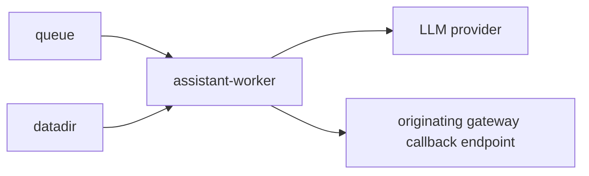
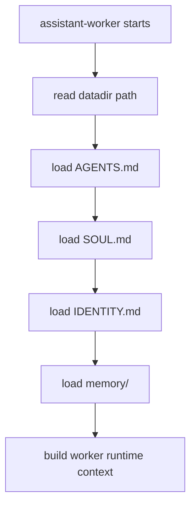
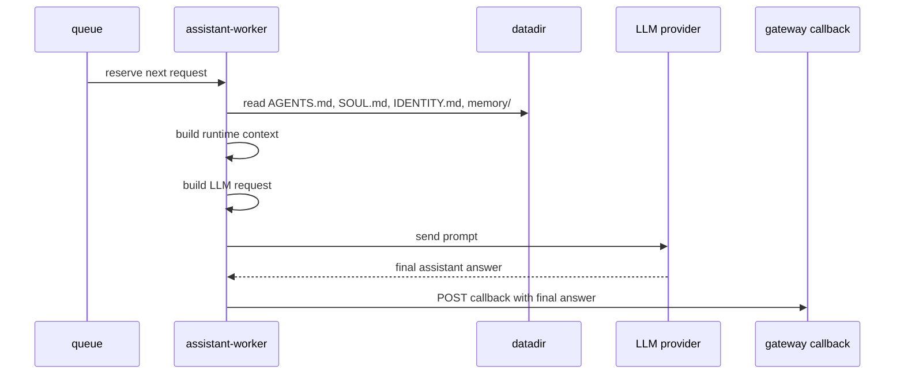

# Service: assistant-worker

## Purpose

`assistant-worker` is the queued execution service inside `assistant`.
It reads accepted requests from the queue, loads the assistant runtime context from `datadir`, sends the request to the configured LLM provider, and sends the final result back to the originating gateway through a callback.

## Status

This document describes the first worker version.
In this version, `assistant-worker` is only an LLM chat executor and does not execute local skills or local tools.
The first configured LLM provider is Grok through the xAI Responses API.

## Responsibilities

- Read accepted jobs from the queue
- Read the assistant runtime context from `datadir`
- Load `AGENTS.md`, `SOUL.md`, `IDENTITY.md`, and `memory/`
- Build the worker prompt from runtime context and queued input
- Form requests to the configured LLM provider
- Receive the final assistant answer from the LLM
- Send the final result to the callback URL that points to the originating gateway
- Expose operational endpoints

## Relations



## Runtime Context

`assistant-worker` starts from the same `datadir` as the rest of `assistant`.
In V1 it must treat this directory as the source of runtime identity, behavior rules, and memory.

Expected layout:

```text
<datadir>/
  AGENTS.md
  SOUL.md
  IDENTITY.md
  skills/
  memory/
  data/
  logs/
  cache/
```

### Runtime Files

- `AGENTS.md`: operating rules and execution constraints
- `SOUL.md`: tone, behavior, and boundaries
- `IDENTITY.md`: assistant identity and role
- `memory/`: assistant memory that may be injected into prompts
- `data/`: runtime state and working data
- `logs/`: worker logs and execution traces
- `cache/`: cached runtime artifacts when needed
- `skills/`: reserved for future worker versions and not used in V1

## Datadir Loading Flow



## Request Processing Flow



## Processing Stages

1. Read the next accepted job from the queue.
2. Read the current runtime context from `datadir`.
3. Load and normalize assistant rules, identity, and memory.
4. Build the LLM input from:
   - queued user request
   - channel metadata from the queue message
   - `AGENTS.md`
   - `SOUL.md`
   - `IDENTITY.md`
   - relevant memory
5. Send the request to the configured LLM provider.
6. Receive the final assistant answer from the LLM.
7. Send the final answer to the gateway callback URL from the queued job.
8. Mark the queue item as completed.

## Queue Input

The worker does not accept public conversation requests.
It only consumes the queue contract created by `assistant-api`.

Main fields used by the worker:

- `message`
- `direction`
- `chat`
- `contact`
- `callback_url`
- `accepted_at`

See [queue-message.md](../contracts/queue-message.md) for the exact queued message shape.

## LLM Request Composition

The worker should build the LLM request from the runtime context, not only from the user message.

The request should include:

- assistant operating rules from `AGENTS.md`
- assistant behavior from `SOUL.md`
- assistant identity from `IDENTITY.md`
- relevant memory from `memory/`
- the queued message and channel metadata

## LLM Provider Configuration

V1 uses Grok through the xAI Responses API.

Main environment variables:

- `XAI_API_KEY`: required xAI API key
- `XAI_BASE_URL`: xAI API base URL, default `https://api.x.ai/v1`
- `XAI_MODEL`: Grok model alias, default `grok-4`
- `XAI_TIMEOUT_MS`: request timeout in milliseconds, default `360000`
- `ASSISTANT_DATADIR`: worker runtime context directory, default `./runtime`

## First Version Scope

V1 intentionally does not include:

- local skill execution
- local tool execution
- multi-step agent loops
- iterative LLM -> tool -> LLM execution

V1 is only:

- queue consumer
- `datadir` context loader
- single LLM request builder
- single LLM response handler
- callback sender

## Callback Rules

- The worker sends the final assistant answer to the callback URL from the queued job.
- The callback target belongs to the originating gateway.
- The worker does not push directly to browser, Telegram, or Email clients.
- Delivery must happen through the gateway callback contract.


## Endpoints

| Endpoint | Purpose |
|---------|---------|
| `GET /` | Service entrypoint summary |
| `GET /status` | Worker readiness |
| `GET /metrics` | Prometheus metrics |
| `GET /openapi.json` | OpenAPI schema |

## Rules

- The worker reads work only from the queue.
- The worker reads runtime identity and behavior from `datadir`.
- The worker is responsible for one LLM request per queued job in V1.
- The worker sends results back only through callback endpoints.
- One queued job should produce one final callback answer in V1.

## Metrics

| Metric | Type | Labels | Description |
|---------|---------|---------|-------------|
| `http_request_time_ms` | `histogram` | `route`, `service`, `response_code` | HTTP request duration in milliseconds |
| `processed_jobs_total` | `counter` | `service` | Total number of processed queue jobs |
| `callback_requests_total` | `counter` | `service`, `status` | Total number of callback requests |
| `queue_messages` | `gauge` | `service` | Current number of queue messages visible to `assistant-worker` |
| `endpoint_requests_total` | `counter` | `endpoint`, `service` | Total number of endpoint requests |

## Future Extensions

Later versions may add:

- local skill execution from `datadir/skills`
- local tool execution
- agent loop
  - `LLM -> skill/tool call -> local execution -> LLM -> ... -> final callback`
- multi-step reasoning before the final callback
