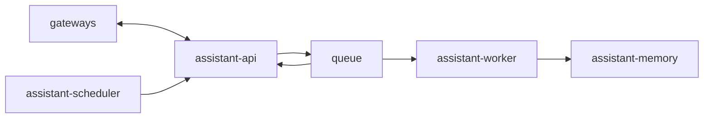

# Service: assistant

## Purpose

`assistant` is the core backend component.
It consists of `assistant-api`, `queue`, `assistant-worker`, and `assistant-memory`.

## Responsibilities

- Accept inbound requests from channel gateways and `assistant-scheduler`
- Validate and enqueue accepted work through `assistant-api`
- Buffer work between intake and processing through `queue`
- Process queued jobs through `assistant-worker`
- Store and retrieve durable memory through `assistant-memory`
- Deliver callbacks through `assistant-api`

## Relations

## Internal Components

- `assistant-api`
- `queue`
- `assistant-worker`
- `assistant-memory`

## Direction Rules

- `assistant-api` accepts requests, writes jobs to `queue`, consumes run events from `queue`, and sends replies to gateways.
- `assistant-scheduler` only triggers new work and does not receive replies from `assistant`.
- `assistant-worker` processes jobs and publishes run events.
- `assistant-memory` owns durable memory retrieval and writes.

## Endpoints

- `assistant` itself does not expose a separate HTTP surface.
- Use the documents for `assistant-api`, `assistant-worker`, and `assistant-memory` for concrete endpoints.

## Metrics

- `assistant` itself does not expose a separate Prometheus registry.
- Metrics are exposed separately by `assistant-api`, `assistant-worker`, and `assistant-memory`.

## Related Documents

- [assistant-api](./assistant/assistant-api.md)
- [assistant-memory](./assistant/assistant-memory.md)
- [assistant-worker](./assistant/assistant-worker.md)
- [gateways](./gateways.md)
- [queue](./queue.md)
