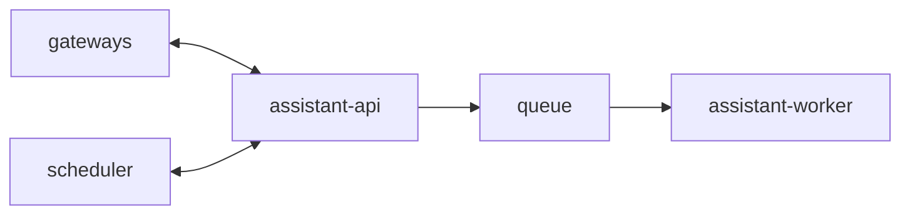

# Service: assistant

## Purpose

`assistant` is the core backend component.
It consists of `assistant-api`, `queue`, and `assistant-worker`.

## Responsibilities

- Accept inbound requests from channel gateways and the scheduler
- Validate and enqueue accepted work through `assistant-api`
- Buffer work between intake and processing through `queue`
- Process queued jobs and produce callback replies through `assistant-worker`

## Relations

## Internal Components

- `assistant-api`
- `queue`
- `assistant-worker`

## Endpoints

- `assistant` itself does not expose a separate HTTP surface.
- Use the documents for `assistant-api` and `assistant-worker` for concrete endpoints.

## Metrics

- `assistant` itself does not expose a separate Prometheus registry.
- Metrics are exposed separately by `assistant-api` and `assistant-worker`.

## Related Documents

- [assistant-api](./assistant-api.md)
- [assistant-worker](./assistant-worker.md)
- [queue](./queue.md)
