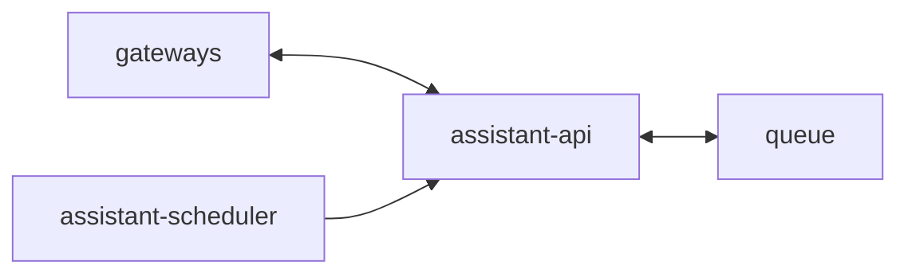

# Service: assistant-api

## Purpose

`assistant-api` is the public transport boundary inside `assistant`.

## Responsibilities

- Accept inbound conversation requests
- Validate request path and body
- Write accepted work to the queue
- Consume worker run events from the queue
- Route and deliver callbacks to gateways
- Select the queue adapter from environment variables
- Return immediate acceptance responses
- Expose operational endpoints

## Relations

## Endpoints

| Endpoint | Purpose |
|---------|---------|
| `GET /` | Service entrypoint summary |
| `POST /conversation/{direction}/{chat}/{contact}` | Accept a conversation event |
| `POST /internal/run-events/{eventType}` | Optional internal run event intake if Redis is not used for this path |
| `GET /status` | Service readiness |
| `GET /metrics` | Prometheus metrics |
| `GET /openapi.json` | OpenAPI schema |

## Request Contract

The request body includes:

- `message`
- `conversation_id`
- callback routing metadata

`assistant-api` validates those fields, stores callback routing metadata, and writes the execution request to the queue.

## Must Not Do

- Run assistant business logic
- Call LLM providers for conversation processing
- Build model prompts
- Persist durable memory directly

## Queue Adapter

- `assistant-api` should choose its queue adapter through env
- `QUEUE_ADAPTER=redis` means Redis queue storage
- `REDIS_URL` defines the Redis connection string
- `REDIS_QUEUE_NAME` defines the Redis transport for execution jobs
- a separate Redis queue or stream may carry worker run events back to `assistant-api`
- Redis is the canonical queue adapter

## Metrics

| Metric | Type | Labels | Description |
|---------|---------|---------|-------------|
| `http_request_time_ms` | `histogram` | `route`, `service`, `response_code` | HTTP request duration in milliseconds |
| `accepted_messages_total` | `counter` | `service` | Total number of accepted conversation requests |
| `queue_messages` | `gauge` | `service` | Current number of messages in the queue |
| `callback_deliveries_total` | `counter` | `service`, `status` | Total number of callback deliveries owned by `assistant-api` |
| `endpoint_requests_total` | `counter` | `endpoint`, `service` | Total number of endpoint requests |

## Related Documents

- [assistant](../assistant.md)
- [Queue Communication](../../architecture/queue-flow.md)
- [Callback Architecture](../../architecture/callback-flow.md)
