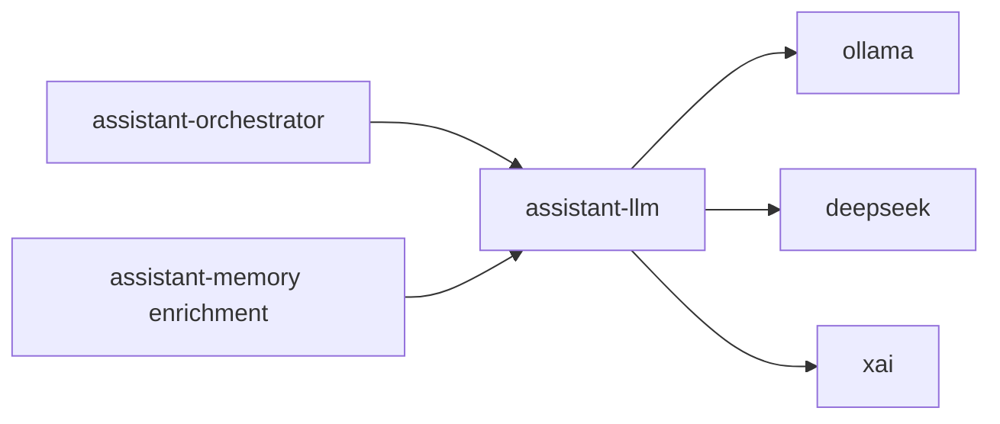

# Service: assistant-llm

## Purpose

`assistant-llm` is the central LLM service for MyConcierge.
It owns provider/model configuration and executes model calls for `assistant-orchestrator` and `assistant-memory` enrichment.

## Responsibilities

- Store and expose LLM config (`provider`, `model`, provider credentials, timeouts)
- Expose provider health and model catalog
- Execute main generation from `messages[]`
- Execute summarize generation
- Execute extract-memory generation for asynchronous enrichment
- Normalize provider behavior across `ollama`, `deepseek`, and `xai`

## Endpoints

- `GET /config`
- `PUT /config`
- `GET /provider-status`
- `GET /models`
- `POST /v1/generate/main`
- `POST /v1/generate/summarize`
- `POST /v1/generate/extract-memory`
- `GET /status`
- `GET /metrics`
- `GET /openapi.json`

## Relations

## Rules

- `assistant-orchestrator` must not own provider settings
- LLM settings are configured only in `assistant-llm`
- Message-based generation is canonical
- Summary failure must not fail user reply delivery
