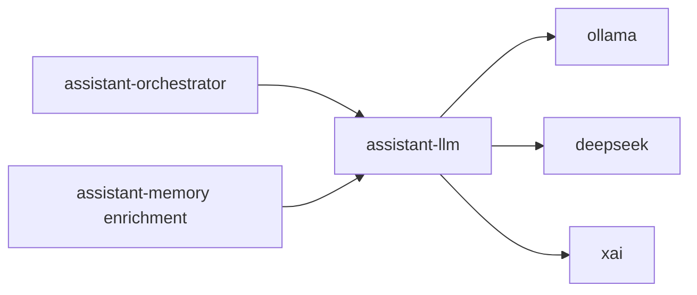

# Service: assistant-llm

## Purpose

`assistant-llm` is the central LLM service for MyConcierge.
It owns provider/model configuration and executes model calls for `assistant-orchestrator` and `assistant-memory` enrichment.

## Contract Version

- Version: `2026-03-29`
- Status: `canonical`
- Legacy API: removed from this document

## Responsibilities

- Store and expose LLM config (`provider`, `model`, provider credentials, timeouts)
- Expose provider health and model catalog
- Execute conversation response generation from `messages[]` and optional `tools[]`
- Execute conversation summary generation from `messages[]`
- Execute fact extraction for asynchronous enrichment
- Normalize provider behavior across `ollama`, `deepseek`, and `xai`

## Endpoints

- `GET /`
- `GET /config`
- `PUT /config`
- `GET /provider-status`
- `GET /models`
- `POST /v1/conversation/respond`
- `POST /v1/conversation/summarize`
- `POST /v1/memory/facts`
- `GET /status`
- `GET /metrics`
- `GET /openapi.json`

## Canonical API

### `POST /v1/conversation/respond`

Purpose:
- Generate assistant response from conversation messages.

Request:
- `messages`: required, `[{ role: "system"|"user"|"assistant", content: string }]`
- `tools`: optional, `[{ name: string, description: string }]`

Response:
- `type`: `"final" | "tool_call" | "error"`
- `message`: string (required for `final` and `error`, empty allowed for `tool_call`)
- `tool_name`: string (for `tool_call`)
- `tool_arguments`: object (for `tool_call`)
- `context`: optional string
- `memory_writes`: optional array
- `tool_observations`: optional array

Response examples:

Final:
```json
{
  "type": "final",
  "message": "Hello, Dmytro! How can I help you today?"
}
```

Tool call:
```json
{
  "type": "tool_call",
  "message": "",
  "tool_name": "memory_fact_search",
  "tool_arguments": {
    "query": "Dmytro"
  }
}
```

Error:
```json
{
  "type": "error",
  "message": "Model response could not be processed safely."
}
```

### `POST /v1/conversation/summarize`

Purpose:
- Generate compact context summary for `conversation.context`.

Request:
- `previous_context`: required string
- `messages`: required message array

Response:
- `summary`: string

Example:
```json
{
  "summary": "User says their name is Dmytro."
}
```

## Memory Extraction API

Active endpoint (used by `assistant-memory` enrichment pipeline):

- `POST /v1/memory/facts`

Request:
- `messages`: required message array
- `conversation_id`: optional string

Response:
- `items`: array of durable facts in third person.

Example (`/v1/memory/facts`):
```json
{
  "items": [
    "User name is Dmytro."
  ]
}
```

## Config & Status

### `GET /`

Purpose:
- Service landing page.

Response:
- HTML page with quick links to main endpoints.

### `GET /config`

Purpose:
- Read current LLM runtime config.

Response example:

```json
{
  "provider": "ollama",
  "model": "qwen3:1.7b"
}
```

### `PUT /config`

Purpose:
- Update LLM runtime config.

Request example:

```json
{
  "provider": "ollama",
  "model": "qwen3:1.7b",
  "ollama_base_url": "http://ollama:11434",
  "ollama_timeout_ms": 360000
}
```

Response:
- Updated config object.

### `GET /provider-status`

Purpose:
- Check provider health and credentials state.

Response example:

```json
{
  "provider": "ollama",
  "status": "ready",
  "reachable": true
}
```

### `GET /models`

Purpose:
- Return model lists by provider.

Response example:

```json
{
  "models": {
    "ollama": ["qwen3:1.7b", "gemma3:1b"],
    "deepseek": ["deepseek-chat", "deepseek-reasoner"],
    "xai": ["grok-4", "grok-4-latest"]
  }
}
```

### `GET /status`

Purpose:
- Read service liveness status.

Response example:

```json
{
  "service": "assistant-llm",
  "status": "ok"
}
```

### `GET /metrics`

Purpose:
- Read Prometheus metrics.

Response:
- Plain text metrics.

### `GET /openapi.json`

Purpose:
- Read OpenAPI schema for this service.

Response:
- OpenAPI JSON document.

## Error Responses

All endpoints return standard NestJS error shape:

```json
{
  "statusCode": 400,
  "message": "Validation failed"
}
```

Typical statuses:
- `400`: invalid request body
- `500`: provider/runtime failure

## Quick curl

Conversation respond:

```bash
curl -sS http://localhost:8087/v1/conversation/respond \
  -H 'content-type: application/json' \
  -d '{
    "tools": [
      { "name": "memory_fact_search", "description": "Search fact memory entries." }
    ],
    "messages": [
      { "role": "system", "content": "You are a helpful assistant." },
      { "role": "user", "content": "My name is Dmytro." }
    ]
  }'
```

Conversation summarize:

```bash
curl -sS http://localhost:8087/v1/conversation/summarize \
  -H 'content-type: application/json' \
  -d '{
    "previous_context": "(empty)",
    "messages": [
      { "role": "user", "content": "My name is Dmytro." },
      { "role": "assistant", "content": "Nice to meet you, Dmytro." }
    ]
  }'
```

Memory facts:

```bash
curl -sS http://localhost:8087/v1/memory/facts \
  -H 'content-type: application/json' \
  -d '{
    "messages": [
      { "role": "user", "content": "My name is Dmytro." },
      { "role": "assistant", "content": "Nice to meet you, Dmytro." }
    ]
  }'
```

## Relations



## Rules

- `assistant-orchestrator` must not own provider settings
- LLM settings are configured only in `assistant-llm`
- Message-based generation is canonical
- Summary failure must not fail user reply delivery
