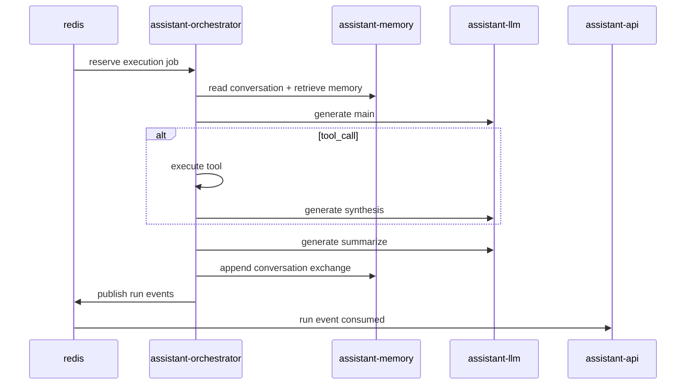

# Service: assistant-orchestrator

## Purpose

`assistant-orchestrator` executes queued assistant runs.
It consumes jobs from Redis, builds runtime context, calls `assistant-llm` for main/synthesis/summary generations, dispatches tools, appends conversation updates through `assistant-memory`, and publishes run events.

## Responsibilities

- Consume accepted jobs from queue
- Build runtime input from bootstrap rules, conversation window, and retrieved memory
- Execute runtime loop and tool dispatch
- Call `assistant-llm` (`/v1/conversation`, `/v1/conversation/summarize`)
- Append final exchange to `assistant-memory` conversation API
- Publish `run.started`, `run.thinking`, `run.completed`, `run.failed`
- Expose operational endpoints (`/status`, `/metrics`, `/config`, `/skills`, `/conversations`)

## Non-Responsibilities

- Does not own LLM provider configuration (owned by `assistant-llm`)
- Does not own durable memory storage (owned by `assistant-memory`)
- Does not call gateway callbacks directly (callbacks are owned by `assistant-api`)

## Runtime Layout

```text
runtime/
  assistant-orchestrator/
    SYSTEM.js
    config/
      orchestrator.json
    skills/
    data/
    logs/
    cache/
```

## Config Scope

`assistant-orchestrator` config is runtime-only:

- `memory_window`
- `run_timeout_seconds`
- `thinking_interval_seconds`
- `enabled_tools`
- Brave integration settings (`brave_*`)

LLM settings (`provider`, `model`, `*_api_key`, `*_base_url`, timeouts) are configured only in `assistant-llm`.

## Tool Surface

Model-callable tools:

- `time_current`
- `web_search`
- `memory_search`
- `memory_fact_search`
- `memory_fact_write`
- `memory_conversation_search`
- `skill_execute`
- `directory_list`
- `directory_create`
- `directory_delete`
- `file_delete`
- `file_write`
- `file_read`

## Processing Flow



## Contracts

- Queue input: [queue-message.md](../../contracts/queue-message.md)
- Callback ownership: [callback-flow.md](../../architecture/callback-flow.md)
- Conversation flow: [conversation.md](../../architecture/conversation.md)
- Memory architecture: [memory.md](../../architecture/memory.md)
