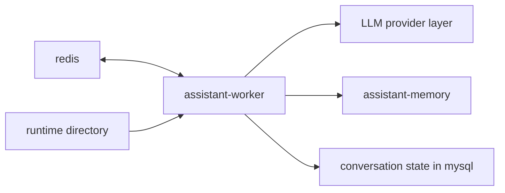
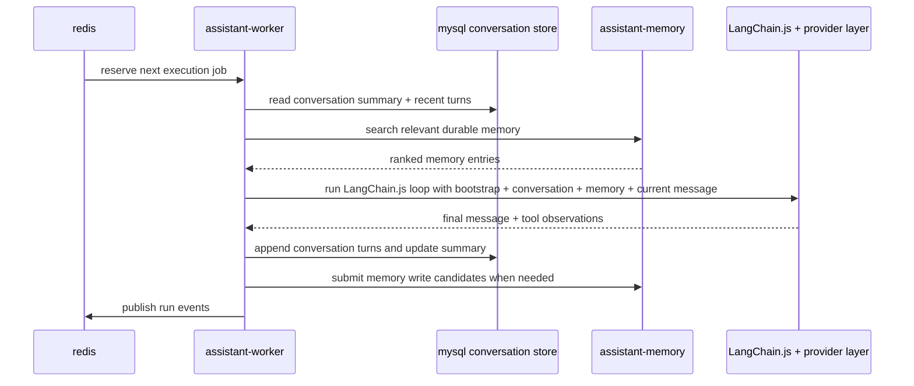
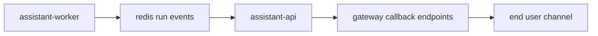

# Service: assistant-worker

## Purpose

`assistant-worker` is the queued execution service inside `assistant`.
It reads accepted jobs from Redis, builds execution context, runs the LangChain.js-based assistant loop, persists conversation state, calls `assistant-memory` when durable memory is needed, and publishes run events back to Redis.

Architecture details:

- queue communication: [queue-flow.md](../../architecture/queue-flow.md)
- callback ownership: [callback-flow.md](../../architecture/callback-flow.md)
- memory ownership: [memory.md](../../architecture/memory.md)

## Status

This document describes the canonical `assistant-worker` architecture.

## Responsibilities

- Read accepted jobs from Redis
- Read bootstrap runtime context from the runtime directory
- Load `SYSTEM.js` and local skill definitions
- Build execution context from bootstrap data, conversation state, and retrieved memory
- Run the LangChain.js-based assistant loop
- Call the configured LLM provider through one shared provider interface
- Persist conversation turns and rolling summaries
- Call `assistant-memory` for durable memory search and writes
- Publish `thinking`, `completed`, and `failed` run events back to Redis
- Expose operational endpoints

## Relations



## Runtime Context

`assistant-worker` starts from the same runtime directory as the rest of `assistant`.
It treats this directory as the source of bootstrap identity, behavior rules, and static skill definitions.

Expected layout:

```text
runtime/
  assistant-worker/
    SYSTEM.js
    skills/
    config/
      worker.json
    data/
    logs/
    cache/
```

### Runtime Files

- `SYSTEM.js`: operating rules and execution constraints
- `skills/`: local skill definitions
- `config/worker.json`: worker runtime settings
- `data/`: runtime state and working data
- `logs/`: worker logs and execution traces
- `cache/`: cached runtime artifacts when needed

## Conversation Model

`assistant-worker` owns canonical conversation state, stored in MySQL.
Schema changes must be applied through `npm run db:migrate`.

Canonical records:

- `conversation_threads`
- `conversation_turns`
- `conversation_summaries`

Conversation rules:

- conversation state lives in canonical MySQL tables
- recent turns and rolling summaries are loaded for each run
- per-conversation locking protects concurrent mutation
- `assistant-worker` owns conversation persistence

## Memory Model

Durable memory is not owned by `assistant-worker`.
`assistant-memory` owns memory retrieval, memory writes, profile state, and memory maintenance.

`assistant-worker` must:

- call `assistant-memory` for `memory_search`
- call `assistant-memory` for `memory_write`
- keep any local runtime memory files only as optional bootstrap knowledge

## Context Assembly

For each run, `assistant-worker` builds context from:

1. bootstrap instructions
   - `SYSTEM.js`
2. conversation context
   - rolling summary from MySQL
   - recent turns from MySQL
3. retrieved memory
   - relevant memory records from `assistant-memory`
4. current request
   - current user message and channel metadata

Hard rules:

- never inject the full memory set
- never inject the full conversation log
- prefer summaries over old raw turns
- apply token budgets consistently

## Tool Surface

The LangChain.js rollout exposes a small but complete tool surface.

Model-callable tools:

- `time_current`
- `memory_search`
- `memory_write`
- `conversation_search`
- `skill_execute`

Rules:

- tools are named by domain or entity boundary
- `memory_search` and `memory_write` call `assistant-memory`
- `conversation_search` reads canonical conversation state
- `skill_execute` executes local skill definitions
- infrastructure operations such as raw MySQL access, raw Redis access, callback dispatch, and queue publishing must not be exposed as tools

## Request Processing Flow



## Processing Stages

1. Read the next accepted job from Redis.
2. Read the current bootstrap context from the runtime directory.
3. Load and normalize assistant rules and worker config.
4. Read conversation summary and recent turns from MySQL.
5. Call `assistant-memory` to retrieve relevant durable memory.
6. Build the LangChain.js execution context.
7. Run the LangChain.js loop and provider calls.
8. Persist updated conversation state in MySQL.
9. Submit memory write candidates to `assistant-memory` when needed.
10. Publish run events back to Redis.

## Queue Input

The worker does not accept public conversation requests.
It consumes execution jobs from `assistant-api` and publishes run events back for `assistant-api`.

Main fields used by the worker:

- `message`
- `direction`
- `chat`
- `contact`
- `conversation_id`
- callback routing identifiers
- `accepted_at`

See [queue-message.md](../../contracts/queue-message.md) for the exact job shape.

## Worker Settings

`assistant-worker` exposes a simple settings page on `/`.

The settings are stored in:

```text
runtime/assistant-worker/config/worker.json
```

The stored config includes fields such as:

```json
{
  "provider": "xai",
  "model": "grok-4",
  "recent_turn_window": 6,
  "thinking_interval_seconds": 2,
  "max_agent_steps": 8
}
```

The settings page shows:

- whether provider credentials are configured
- whether the provider API check succeeds
- the active model name
- the last provider status message
- the thinking event interval in seconds
- current LangChain.js execution limits

## LLM Provider Configuration

The provider layer remains shared and extensible.

Supported provider directions:

- `deepseek`
- `xai`
- `ollama`
- future `openai`

Main environment variables:

- `DEEPSEEK_API_KEY`
- `DEEPSEEK_BASE_URL`
- `DEEPSEEK_MODEL`
- `DEEPSEEK_TIMEOUT_MS`
- `XAI_API_KEY`
- `XAI_BASE_URL`
- `XAI_MODEL`
- `XAI_TIMEOUT_MS`
- `OLLAMA_BASE_URL`
- `OLLAMA_MODEL`
- `OLLAMA_TIMEOUT_MS`
- `ASSISTANT_DATADIR`

## Callback Rules

- `assistant-worker` publishes run events back to Redis
- `assistant-api` consumes those run events and performs gateway callbacks
- `assistant-worker` must not call gateway callback endpoints directly



## Endpoints

| Endpoint | Purpose |
|---------|---------|
| `GET /` | Worker settings page |
| `GET /config` | Current worker runtime config |
| `PUT /config` | Update worker runtime config |
| `GET /provider-status` | Current provider credential and reachability status |
| `GET /status` | Worker readiness |
| `GET /metrics` | Prometheus metrics |
| `GET /openapi.json` | OpenAPI schema |

## Rules

- The worker reads work only from Redis.
- The worker reads runtime identity and behavior from the runtime directory.
- The worker is responsible for one execution run per queued job.
- The worker sends results back only through run events.
- One queued job should produce one final completed or failed run event.

## Metrics

| Metric | Type | Labels | Description |
|---------|---------|---------|-------------|
| `http_request_time_ms` | `histogram` | `route`, `service`, `response_code` | HTTP request duration in milliseconds |
| `processed_jobs_total` | `counter` | `service` | Total number of processed execution jobs |
| `run_events_total` | `counter` | `service`, `event_type`, `status` | Total number of published run events |
| `queue_messages` | `gauge` | `service` | Current number of queue messages visible to `assistant-worker` |
| `endpoint_requests_total` | `counter` | `endpoint`, `service` | Total number of endpoint requests |

## Future Extensions

Later versions may add:

- richer LangChain.js orchestration
- selective retrieval from recent conversations
- local skill execution from `runtime/assistant-worker/skills`
- local tool execution
- iterative `LLM -> tool -> LLM` execution
- multi-step reasoning before the final completed run event
