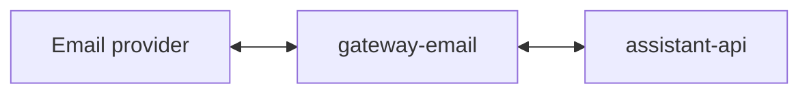

# Service: gateway-email

## Purpose

Receive Email events and send Email replies.

## Status

TODO: this service is documented as part of the target architecture but is not implemented in this repository yet.

## Planned Responsibilities

- Accept inbound Email events
- Convert them to `assistant-api` requests
- Expose callback endpoints for Email replies
- Expose operational endpoints

## Planned Relations

## Planned Endpoints

- TODO

## Planned Metrics

- TODO

## Rules

- The gateway stays thin.
- Assistant business logic does not live here.
