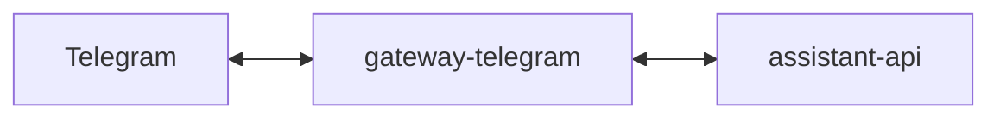

# Service: gateway-telegram

## Purpose

Receive Telegram events and send Telegram replies.

## Status

TODO: this service is documented as part of the target architecture but is not implemented in this repository yet.

## Planned Responsibilities

- Accept inbound Telegram events
- Convert them to `assistant-api` requests
- Expose callback endpoints for Telegram replies
- Expose operational endpoints

## Planned Relations

## Planned Endpoints

- TODO

## Planned Metrics

- TODO

## Rules

- The gateway stays thin.
- Assistant business logic does not live here.
- Telegram callbacks should point to `gateway-telegram`.
