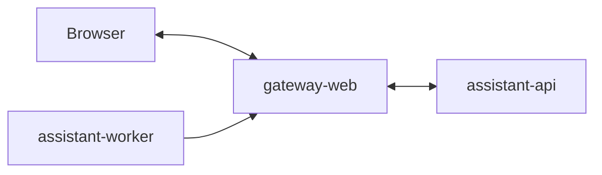

# Service: gateway-web

## Purpose

Provide a simple Web chat UI for the local assistant.

## Responsibilities

- Serve the Web chat page
- Accept WebSocket chat messages from the browser
- Convert browser messages into `assistant-api` requests
- Expose a callback endpoint for `assistant-worker`
- Send callback messages back to the browser through WebSocket
- Expose `GET /status`
- Expose `GET /metrics`
- Expose `GET /openapi.json`

## Relations



## Endpoints

| Endpoint | Purpose |
|---------|---------|
| `GET /` | Web chat page |
| `WS /ws` | Browser WebSocket transport |
| `POST /callbacks/assistant/:contact` | Receive assistant callback for a browser session |
| `GET /status` | Service readiness |
| `GET /metrics` | Prometheus metrics |
| `GET /openapi.json` | OpenAPI schema |

## Internal Parts

- `chat-page`: returns the simple Web chat page
- `websocket-gateway`: accepts browser WebSocket connections
- `assistant-api-client`: sends accepted browser messages to `assistant-api`
- `callback-controller`: accepts `assistant-worker` callback requests
- `session-registry`: maps callback messages to the correct WebSocket connection
- `status`: returns service readiness
- `metrics`: returns Prometheus metrics
- `openapi`: returns the gateway OpenAPI schema

## Runtime Flow

1. The browser opens `GET /`.
2. The browser opens `WS /ws`.
3. The browser sends a chat message through WebSocket.
4. `gateway-web` maps the WebSocket session to a chat and contact.
5. `gateway-web` calls `assistant-api`.
6. `assistant-api` accepts the message and writes it to the queue.
7. `assistant-worker` processes the job.
8. `assistant-worker` sends a callback to `POST /callbacks/assistant/:contact`.
9. `gateway-web` finds the right WebSocket session.
10. `gateway-web` sends the assistant message back to the browser.

## State Rules

- `gateway-web` should keep only light session state.
- Assistant business state should stay outside `gateway-web`.
- WebSocket session mapping may live in memory in the first MVP.
- If `gateway-web` is scaled horizontally later, the session mapping will need a shared store or sticky sessions.

## Current Repository Location

`gateway-web` is currently stored in the repository root to keep the first implementation small:

```text
src/
  assistant-api/
  chat/
  observability/
  app.module.ts
  main.ts
public/
  index.html
  app.js
  styles.css
test/
Dockerfile
```

## Future Repository Location

If more services are implemented in the same repository later, `gateway-web` may move into `apps/gateway-web/`.

## Rules

- The gateway stays thin.
- Assistant business logic does not live here.
- The browser talks to `gateway-web` through WebSocket.
- `gateway-web` talks to `assistant-api` through HTTP.
- `assistant-worker` sends callbacks to `gateway-web`.
- `gateway-web` maps callbacks back to the correct WebSocket session.
- `gateway-web` exposes `GET /openapi.json` for the shared Swagger UI.

## Metrics

| Metric | Type | Labels | Description |
|---------|---------|---------|-------------|
| `gateway_web_active_websocket_sessions` | `gauge` | none | Current number of active WebSocket sessions |
| `gateway_web_incoming_messages_total` | `counter` | none | Total number of incoming WebSocket messages |
| `gateway_web_callbacks_total` | `counter` | `delivered` | Total number of callback deliveries |
| `gateway_web_assistant_api_requests_total` | `counter` | `status` | Total number of requests from `gateway-web` to `assistant-api` |
| `gateway_web_status_requests_total` | `counter` | none | Total number of status endpoint requests |
| `gateway_web_metrics_requests_total` | `counter` | none | Total number of metrics endpoint requests |
