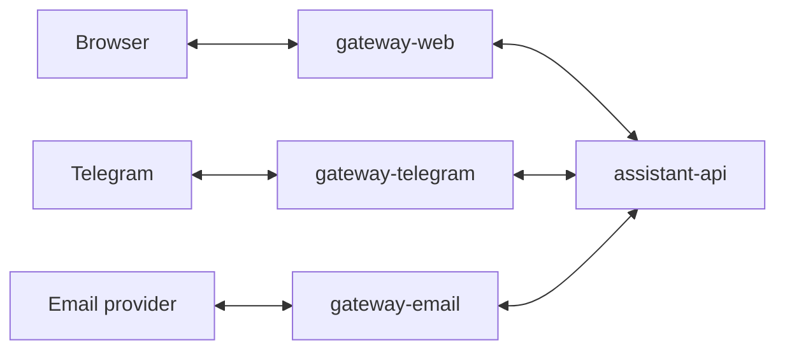

# Service Group: gateways

## Purpose

`gateways` is the channel-facing service group for `assistant`.
Each gateway adapts one external channel to the common `assistant-api` contract and receives callbacks back from `assistant-api`.

## Responsibilities

- Accept channel-specific inbound events
- Normalize inbound requests into the `assistant-api` conversation contract
- Keep channel-local runtime state that is required for delivery and threading
- Expose callback endpoints for assistant replies
- Translate assistant callback payloads into channel-specific delivery actions

## Relations

## Components

- [gateway-web](./gateways/gateway-web.md)
- [gateway-telegram](./gateways/gateway-telegram.md)
- [gateway-email](./gateways/gateway-email.md)

## Implementation Order

1. `gateway-web`
2. `gateway-email`
3. `gateway-telegram`

## Shared Rules

- gateways stay thin
- assistant business logic does not live in gateways
- `assistant-api` owns all external callback delivery
- gateways translate callback payloads into channel-native delivery
- gateways may keep local transport runtimes, but canonical assistant conversation state still lives in `assistant-worker`

## Related Documents

- [Callback Architecture](../architecture/callback-flow.md)
- [Conversation API Contract](../contracts/conversation-api.md)
