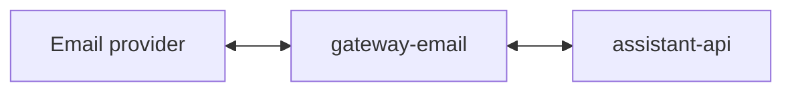

# Service: gateway-email

## Purpose

`gateway-email` is the Email transport adapter for `assistant`.
It receives inbound Email events, converts them into `assistant-api` requests, and delivers assistant replies back through Email.

## Responsibilities

- Manage IMAP and SMTP credentials through its own web panel
- Sync the mailbox into a local runtime on a fixed delay
- Receive inbound Email provider events
- Normalize inbound messages into the `assistant-api` conversation contract
- Persist a local mailbox runtime with threads and message copies
- Expose callback endpoints for assistant replies
- Deliver final responses to Email recipients
- Expose operational endpoints

## Relations

## Endpoints

| Endpoint | Purpose |
|---------|---------|
| `GET /` | Show the email gateway web panel |
| `GET /config` | Read stored email gateway configuration |
| `PUT /config` | Update IMAP, SMTP, and sync settings |
| `GET /threads` | List local email threads |
| `GET /threads/:conversationId` | Read one local email thread |
| `POST /sync` | Trigger a mailbox sync immediately |
| `POST /inbound/email` | Receive inbound Email webhook or polling payloads |
| `POST /response/:conversationId` | Receive the final assistant response and send it as an email reply |
| `POST /thinking/:conversationId` | Receive a transient thinking callback and acknowledge it for email |
| `GET /status` | Service readiness |
| `GET /metrics` | Prometheus metrics |
| `GET /openapi.json` | OpenAPI schema |

## Callback Rules

- `gateway-email` sends inbound messages to `assistant-api`
- `assistant-api` owns callback delivery
- `assistant-api` calls back to `gateway-email`
- `gateway-email` maps callback payloads to the correct Email thread or recipient
- callback replies are sent with preserved `In-Reply-To` and `References`

## Metrics

| Metric | Type | Labels | Description |
|---------|---------|---------|-------------|
| `http_request_time_ms` | `histogram` | `route`, `service`, `response_code` | HTTP request duration in milliseconds |
| `incoming_messages_total` | `counter` | `service`, `transport` | Total number of inbound Email events |
| `callback_deliveries_total` | `counter` | `delivered`, `service` | Total number of callback deliveries accepted by the gateway |
| `upstream_requests_total` | `counter` | `service`, `status`, `upstream` | Total number of upstream requests to Email infrastructure or `assistant-api` |
| `endpoint_requests_total` | `counter` | `endpoint`, `service` | Total number of endpoint requests |
| `email_sync_runs_total` | `counter` | `service`, `status` | Total number of mailbox sync runs |
| `email_threads_total` | `gauge` | `service` | Current number of locally stored email threads |

## Rules

- The gateway stays thin.
- Assistant business logic does not live here.
- Email callbacks should point to `gateway-email`.
- One email chain maps to one stable `conversation_id`.

## Related Documents

- [gateways](../gateways.md)
- [Callback Architecture](../../architecture/callback-flow.md)
