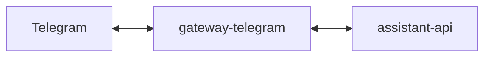

# Service: gateway-telegram

## Purpose

`gateway-telegram` is the Telegram transport adapter for `assistant`.
It receives Telegram updates, converts them into `assistant-api` requests, and delivers assistant replies back to Telegram.

## Responsibilities

- Manage the Telegram Bot token through its own web panel
- Receive inbound Telegram updates
- Normalize Telegram messages into the `assistant-api` conversation contract
- Persist a local chat runtime with threads and message copies
- Expose callback endpoints for assistant replies
- Deliver final responses and thinking notifications to Telegram
- Expose operational endpoints

## Relations

## Endpoints

| Endpoint | Purpose |
|---------|---------|
| `GET /` | Show the Telegram gateway web panel |
| `GET /config` | Read stored Telegram gateway configuration |
| `PUT /config` | Update the Telegram Bot token |
| `GET /threads` | List local Telegram threads |
| `GET /threads/:conversationId` | Read one local Telegram thread |
| `POST /inbound/telegram` | Receive inbound Telegram webhook or polling payloads |
| `POST /response/:conversationId` | Receive the final assistant response and send it as a Telegram reply |
| `POST /thinking/:conversationId` | Receive a transient thinking callback and acknowledge it for Telegram |
| `POST /tool/:conversationId` | Receive tool activity callbacks and acknowledge them for Telegram |
| `GET /status` | Service readiness |
| `GET /metrics` | Prometheus metrics |
| `GET /openapi.json` | OpenAPI schema |

## Callback Rules

- `gateway-telegram` sends inbound messages to `assistant-api`
- `assistant-api` owns callback delivery
- `assistant-api` calls back to `gateway-telegram`
- `gateway-telegram` maps callback payloads to Telegram chats and message threads in its local runtime
- callback replies are sent with `reply_to_message_id` and `message_thread_id` when available

## Metrics

| Metric | Type | Labels | Description |
|---------|---------|---------|-------------|
| `http_request_time_ms` | `histogram` | `route`, `service`, `response_code` | HTTP request duration in milliseconds |
| `incoming_messages_total` | `counter` | `service`, `transport` | Total number of inbound Telegram updates |
| `callback_deliveries_total` | `counter` | `delivered`, `service` | Total number of callback deliveries accepted by the gateway |
| `upstream_requests_total` | `counter` | `service`, `status`, `upstream` | Total number of upstream requests to Telegram or `assistant-api` |
| `endpoint_requests_total` | `counter` | `endpoint`, `service` | Total number of endpoint requests |
| `telegram_threads_total` | `gauge` | `service` | Current number of locally stored Telegram threads |

## Rules

- The gateway stays thin.
- Assistant business logic does not live here.
- Telegram callbacks should point to `gateway-telegram`.
- One Telegram chat or topic maps to one stable `conversation_id`.

## Related Documents

- [gateways](../gateways.md)
- [Callback Architecture](../../architecture/callback-flow.md)
