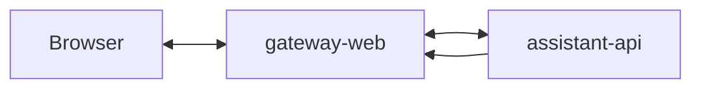

# Service: gateway-web

## Purpose

Provide a simple Web chat UI for the local assistant.

## Responsibilities

- Serve the Web chat page
- Accept WebSocket chat messages from the browser
- Keep a stable browser conversation id in cookies
- Convert browser messages into `assistant-api` requests
- Expose `response` and `thinking` callback endpoints for `assistant-api`
- Expose `event` callback endpoint for `assistant-api`
- Send final responses and thinking signals back to the browser through WebSocket
- Read browser chat history from `assistant-memory`
- Expose `GET /status`
- Expose `GET /metrics`
- Expose `GET /openapi.json`

## Relations



## Endpoints

| Endpoint | Purpose |
|---------|---------|
| `GET /` | Web chat page |
| `WS /ws` | Browser WebSocket transport |
| `POST /response/:conversationId` | Receive the final assistant response for a browser session |
| `POST /thinking/:conversationId` | Receive a transient thinking signal for a browser session |
| `POST /event/:conversationId` | Receive run and memory events for a browser session |
| `GET /status` | Service readiness |
| `GET /metrics` | Prometheus metrics |
| `GET /openapi.json` | OpenAPI schema |

## Internal Parts

- `chat-page`: returns the simple Web chat page
- `websocket-gateway`: accepts browser WebSocket connections
- `assistant-api-client`: sends accepted browser messages to `assistant-api`
- `callback-controller`: accepts `assistant-api` callback requests
- `session-registry`: maps callback messages to the correct WebSocket connection
- `runtime-store`: reads canonical conversation state from `assistant-memory`
- `status`: returns service readiness
- `metrics`: returns Prometheus metrics
- `openapi`: returns the gateway OpenAPI schema

## Runtime Flow

1. The browser opens `GET /`.
2. The browser opens `WS /ws`.
3. The browser sends a chat message through WebSocket.
4. `gateway-web` resolves the stable browser `conversation_id` from the cookie and maps the WebSocket connection to it.
5. `gateway-web` calls `assistant-api`.
6. `assistant-api` accepts the message and writes it to the queue.
7. `assistant-orchestrator` processes the job.
8. While the worker run is active, `assistant-orchestrator` may publish `thinking` run events.
9. `assistant-api` consumes those events and may send `POST /thinking/:conversationId`.
10. `gateway-web` forwards the thinking state to the active browser session for the requested number of seconds.
11. `assistant-api` sends the final callback to `POST /response/:conversationId`.
12. `assistant-api` sends run and memory event callbacks to `POST /event/:conversationId`.
13. `assistant-orchestrator` appends the user/assistant exchange to canonical conversation state in `assistant-memory`.
14. `gateway-web` finds the right WebSocket session.
15. `gateway-web` sends the assistant message and selected events back to the browser.

## State Rules

- `gateway-web` should keep only light session state.
- Assistant business state should stay outside `gateway-web`.
- WebSocket session mapping may live in memory in the first MVP.
- Browser chat history is stored canonically in `assistant-memory`.
- Browser chat continuity uses a stable `conversation_id` stored in a cookie.
- `gateway-web` uses one configured singleton `user_id` for browser messages.
- If `gateway-web` is scaled horizontally later, the session mapping will need a shared store or sticky sessions.

## Current Repository Location

`gateway-web` is currently stored in the repository root to keep the first implementation small:

```text
src/
  assistant-api/
  chat/
  observability/
  app.module.ts
  main.ts
public/
  index.html
  app.js
  styles.css
test/
Dockerfile
```

## Future Repository Location

If more services are implemented in the same repository later, `gateway-web` may move into `apps/gateway-web/`.

## Rules

- The gateway stays thin.
- Assistant business logic does not live here.
- The browser talks to `gateway-web` through WebSocket.
- `gateway-web` talks to `assistant-api` through HTTP.
- `gateway-web` sends callback routing metadata and `conversation_id` to `assistant-api`.
- `assistant-api` owns callback routing and delivery.
- `gateway-web` maps callbacks back to the correct WebSocket session.
- `gateway-web` uses the configured `user_id` as the browser contact identifier and the cookie-backed `conversation_id` as thread id.
- `gateway-web` exposes `GET /openapi.json` for the shared Swagger UI.

## Metrics

| Metric | Type | Labels | Description |
|---------|---------|---------|-------------|
| `http_request_time_ms` | `histogram` | `route`, `service`, `response_code` | HTTP request duration in milliseconds |
| `websocket_active_sessions` | `gauge` | `service` | Current number of active WebSocket sessions |
| `incoming_messages_total` | `counter` | `service`, `transport` | Total number of incoming messages |
| `callback_deliveries_total` | `counter` | `delivered`, `service` | Total number of callback deliveries |
| `upstream_requests_total` | `counter` | `service`, `status`, `upstream` | Total number of upstream HTTP requests |
| `endpoint_requests_total` | `counter` | `endpoint`, `service` | Total number of endpoint requests |

## Related Documents

- [gateways](../gateways.md)
- [Callback Architecture](../../architecture/callback-flow.md)
