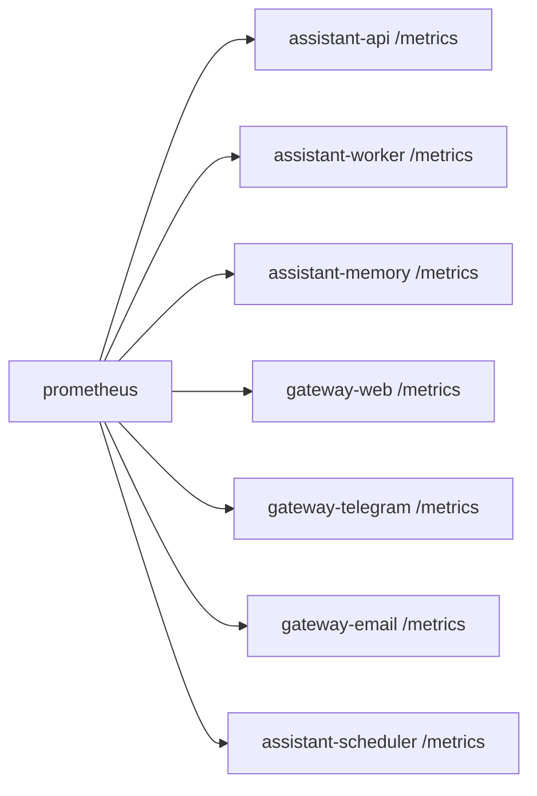

# Service: prometheus

## Purpose

`prometheus` is the metrics scraper and storage component for `assistant`.
It collects service-local metrics and makes them queryable for dashboards and alerts.

## Responsibilities

- Scrape `/metrics` from runtime services
- Store time-series metric samples
- Expose the Prometheus query and scrape interface
- Support dashboards and alerting integrations

## Relations

## Endpoints

| Endpoint | Purpose |
|---------|---------|
| `GET /-/healthy` | Service health check |
| `GET /-/ready` | Service readiness check |
| `GET /api/v1/query` | Instant metric queries |
| `GET /api/v1/query_range` | Range metric queries |
| `GET /api/v1/targets` | Active scrape target status |

## Metrics

- `prometheus` exposes its own native Prometheus metrics.
- Project-specific documentation focuses on the metrics produced by application services, not on Prometheus internals.

## Rules

- `prometheus` scrapes services; services do not push metrics to it.
- Each runtime service owns its own metric registry and `/metrics` endpoint.
- Scrape intervals and retention settings are deployment concerns.
