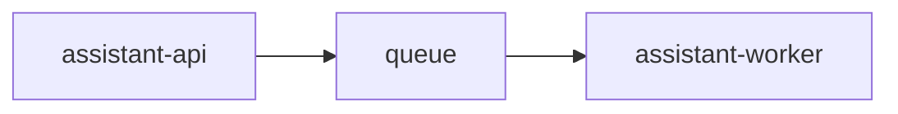

# Service: queue

## Purpose

Transport work from `assistant-api` to `assistant-worker`.

## Responsibilities

- Accept accepted jobs from `assistant-api`
- Keep jobs until a worker reads them
- Support more than one worker instance
- Expose queue depth to metrics

## Relations

## Endpoints

- No project HTTP endpoints

## Metrics

- `queue` does not expose its own Prometheus endpoint in this repository.
- Queue depth is surfaced through:
  - `queue_messages{service="assistant-api"}`
  - `queue_messages{service="assistant-worker"}`

## Rules

- The queue is the only transport layer between `assistant-api` and `assistant-worker`.
- The queue contract must stay stable across retries and scaling.
- Redis is the current queue technology.
- File queue may stay as an optional fallback adapter.
