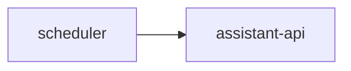

# Service: scheduler

## Purpose

Run cron-based tasks and trigger `assistant-api`.

## Status

TODO: this service is documented as part of the target architecture but is not implemented in this repository yet.

## Planned Responsibilities

- Run jobs on a cron schedule
- Call `assistant-api`
- Stop after the job is accepted for queueing
- Expose operational endpoints

## Planned Relations

## Planned Endpoints

- TODO

## Planned Metrics

- TODO

## Rules

- The scheduler stays thin.
- It does not run assistant business logic.
- It does not send replies to gateways.
- In Kubernetes, scheduled jobs should use `CronJob`.
