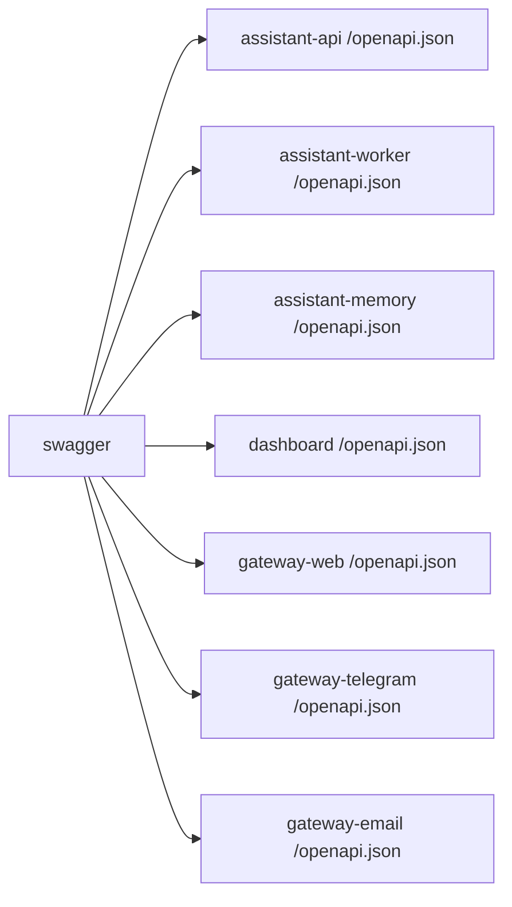

# Service: swagger

## Purpose

Show one shared Swagger UI for the runtime.

## Responsibilities

- Read `assistant-api` OpenAPI schema
- Read `assistant-worker` OpenAPI schema
- Read `assistant-memory` OpenAPI schema
- Read `dashboard` OpenAPI schema
- Read `gateway-web` OpenAPI schema
- Read `gateway-telegram` OpenAPI schema
- Read `gateway-email` OpenAPI schema
- Show the schemas in one UI
- Let the user switch between the schemas

## Relations

## Endpoints

| Endpoint | Purpose |
|---------|---------|
| `GET /` | Shared Swagger UI |

## Source Endpoints

- `http://localhost:3000/openapi.json`
- `http://localhost:3001/openapi.json`
- `http://localhost:3002/openapi.json`
- `http://localhost:8080/openapi.json`
- `http://localhost:8079/openapi.json`
- `http://localhost:8081/openapi.json`
- `http://localhost:8082/openapi.json`

## Metrics

- `swagger` does not expose project-specific Prometheus metrics in this repository.

## Rules

- One shared Swagger UI is preferred over multiple Swagger UI services.
- Swagger UI does not merge schemas. It shows separate schemas in one interface.

## Related Documents

- [gateways](./gateways.md)
